---
title: "社群媒體分析_期中報告_第13組"
author: "陳柏愷 劉岱宜 張文瑜 "
date: "2019年6月11日"
output: 
  html_document:
    toc: true
    toc_depth: 2
    toc_float:
      collapsed: false
      smooth_scroll: false
---  

  
# 六位準總統參選人之PTT意見領袖分析  
+  壹、動機與目的　　
+  貳、文獻回顧與探討  
+  參、六位總統準參選人的網絡、文字雲、情緒分析
   +  賴清德  
   +  蔡英文  
   +  韓國瑜  
   +  朱立倫  
   +  郭台銘  
   +  柯文哲
+  肆、相似詞比較  
+  伍、總結  
+  參考文獻


# 壹、動機與目的  
隨著2020年總統大選的到來，網路與媒體也開始有沸沸揚揚的聲浪，有鑑於上次2018年九合一大選中縣市首長的選舉與網路有著密不可分的關聯，我們這次以抓取ＰＴＴ資料的方式來分析這些候選人的意見領袖，希望藉由查看他們是用什麼方式來炒起聲量？他們帶起的風向的是正面還是負面形象？成功與否？彼此之間有什麼差異？來判斷這次網路聲量上能夠占一席之地的參選人會是誰。  
  
備註：我們在挑選分析的參選人的方式，除了有宣布參選者，還包括未宣布但是呼聲高的人，如柯文哲。


### 讀入套件

```{r message=FALSE}
library(knitr)
library(dplyr)
library(kableExtra)
knitr::opts_chunk$set(echo = TRUE)
options(knitr.table.format = "html") 
library(readr)
library(dplyr)
library(jiebaR)
library(tidyr)
library(tidytext)
library(igraph)
library(stringr)
library(ggplot2)
library(data.table)
library(igraph)
library(wordcloud2)
library(stringi)
library(widyr)
library(scales)
require(tm)
require(data.table)
require(quanteda)
require(Matrix)
require(slam)
require(Rtsne)
require(randomcoloR)
library(magrittr)
library(tsne)
```

# 貳、文獻回顧與探討    

+  意見領袖之於政治：  
早在1944年，Lazarsfeld et al.(1944) 與研究團隊於當年美國總統大選，嘗試找出媒體輿論如何影響個人的投票決定，意外發現比起大眾傳播的方式，人際之間的傳播較有可能改變閱聽者的態度；現今的新網路媒體－INSIDE 硬塞的網路趨勢觀察也指出政治人物在新聞或節目上所說的話，首先影響的是傳統選民，但若要發揮更大的作用散播至網路上，仍得靠「仲介者」。可以看出：不論是以往或是當今，我們都可以發現意見領袖對於選戰而言，是舉足情重的重要角色。  
     
    
+  網路社群上的意見領袖：  
Park, C. S. (2013) 表示推特的意見領導會導致他人政治參與度增加，因此我們推測台灣的論壇PTT也有可能會具備相似的效果，不僅能引起討論熱度，也能帶動政治參與。  
    
        
+  網路聲量對於政治的影響：                                               
跳脫於傳統「陸軍」宣傳方式的選戰策略，自2014年柯文哲以網路行銷策略，成功當選台北市長以來，傾聽、監控、帶領網路風向，已成為現今時代中候選人不可或缺的重要環節，根據中央大學與台北大學對網路政治參與的論文研究指出，過去被認為不夠理性的網友意見，已儼然成為主導政治選戰的關鍵因素之一。而贏戰數位行銷總監周智鴻也表示，在2018的九合一選舉，不只縣市長，連縣市議員，也積極蒐集網路輿情、經營自己的粉絲專頁、社群，與選民互動，從現下到線上整合的選戰策略已成趨勢。
       
         
+  台灣最有影響力的社群網站：  
《今周刊》於2008年解構社群－提出「全台灣網路使用者之中，每十個人就有一個人是批踢踢的註冊會員」。《數位時代》於2016年提出PTT擁有超過2萬個分類看板，每天有超過2萬篇文章更新，從八卦、娛樂、運動、政治、文學、旅遊、軍旅與網購無所不包，註冊帳號150萬，尖峰時段超過15萬人同時在線，多集中在18～35歲，是台灣最有影響力的網路社群。《報橘》在2015年發表的文章認為：ptt在台灣民主與傳播史上扮演的角色，是獨一無二的「既菁英又民粹的公民發聲平台」，菁英，指的是具有知識基礎；民粹，指的是反映民意；野草莓學運與洪仲丘事件發起，皆是由ptt這個平台組織起來，因此我們可以看到，ptt在政治傳播上的重要，也因此本文選擇以PTT的八卦版作為分析的社群。 　


# 參、六位總統準參選人的網絡、文字雲、情緒分析   
資料來源：讀取ptt六位參選人的討論資料、討論串回覆資料（2019.1.1-2019.5.31） 　

```{r}
li = fread("data/賴清德_articleMetaData.csv",encoding="UTF-8")
li_r = fread("data/賴清德_articleMetaData_response.csv",encoding="UTF-8")
tsai = fread("data/蔡英文_articleMetaData.csv",encoding="UTF-8")
tsai_r = fread("data/蔡英文_articleMetaData_response.csv",encoding="UTF-8")
zhu1 = read_csv("data/朱立倫_articleMetaData_response.csv")
han1 = read_csv("data/韓國瑜_articleMetaData_reponse.csv")
han = read_csv("data/韓國瑜_articleMetaData.csv")
zhu = read_csv("data/朱立倫_articleMetaData.csv")
kp = fread("data/柯文哲_articleMetaData.csv",encoding="UTF-8")
kp_r = fread("data/柯文哲_articleMetaData_response.csv",encoding="UTF-8")
kuo = fread("data/郭台銘_articleMetaData.csv",encoding="UTF-8")
kuo_r = fread("data/郭台銘_articleMetaData_response.csv",encoding="UTF-8")
```


# 賴清德的ptt社群網絡領袖分析  

## 找出賴神的ptt意見領袖
### 整理並標記
```{r}
# 選出需要的欄位
li_r <- li_r[,c(4,7,8,10)]
colnames(li_r)=c("artUrl", "cmtPoster", "cmtStatus"," cmtContent")
# 發文者數量 1830
length(unique(li$artPoster))
# 回覆者數量 40551
length(unique(li_r$cmtPoster))
# 總共有參與的人數 41019
allPoster <- c(li$artPoster, li_r$cmtPoster)
length(unique(allPoster)) #去掉重複
```

```{r}
# 整理所有出現過的使用者
# 如果曾發過文的話就標註他爲poster；沒有發過文的話則標註他爲replyer
userList <- data.frame(user=unique(allPoster)) %>%
              mutate(type=ifelse(user%in%li$artPoster, "poster", "replyer"))
```

### 建立社群網路圖
```{r}
# 把評論和文章依據artUrl innerJoin起來
li_all <- merge(x = li, y = li_r, by = "artUrl")

# 取出 cmtPoster(回覆者)、artPoster(發文者)、artUrl(文章連結) 三個欄位
link <- li_all %>%
      dplyr::select(cmtPoster, artPoster, artUrl)
# 這個順序是因為graph_from_data_frame 有規定(若有方向)第一個欄位是from 第二個欄位是to, 後面的欄位就是描述這個關係的東西

# 建立網路關係
net <- graph_from_data_frame(d=link, directed=T)
```
  
> 因網路評論人數眾多，設定發文數大於5，回覆則數500以上，社群degree大於5，才會納入圖片討論。

### 縮小範圍  

因網路評論人數眾多，我們去設定發文數跟回文數達一定數量才會列入圖片。
篩發文數可以代表那個發文者是不是高度關注該參選人並熱衷於分享；篩回文數可以代表那個發文者的文章能夠一定引起共鳴。  
篩掉6009個帳號，留下常活動的272個。

```{r}
# 篩選回應數和發文次數
table(li$commentNum>=500)
li_poster=table(li$artPoster) %>% sort %>% as.data.frame 
colnames(li_poster)=c("artPoster","freq")
li_poster=li_poster %>% filter(freq>=5) 

link <- li_all %>%
  filter(commentNum >=500) %>% #回應數大於500則
  filter(artPoster==li_poster$artPoster) %>% #發文次數>5次
  #filter(cmtStatus!="→") %>%  # ptt篩出推噓
      select(cmtPoster, artPoster, artUrl, cmtStatus) 

# 這邊要篩選link中有出現的使用者(否則沒有在link中出現的使用者也會被igraph畫上去，沒有意義)
filtered_user <- userList %>%
          filter(user%in%link$cmtPoster | user%in%link$artPoster) %>% 
          arrange(desc(type))
```


### 畫出關聯圖
```{r}
# # 建立網路關係
#  set.seed(487)
#  net <- graph_from_data_frame(d=link, v=filtered_user, directed=F)
#  # DEGREE大於10 將印出LABEL否則則無
#  labels <- degree(net)
#  V(net)$label <- names(labels)
#  
#  V(net)$color <- ifelse(V(net)$type=="poster", "gold", "lightblue")
#  # 依據回覆發生的文章所對應的主題，對他們的關聯線進行上色
#  E(net)$color <- ifelse(E(net)$cmtStatus == "推", "lightgreen", "palevioletred")
#  
#  plot(net, vertex.size=2, edge.arrow.size=.2,
#        vertex.label=ifelse(degree(net) > 7, V(net)$label, NA),  vertex.label.ces=.5)
#   # 加入標示
#   legend(x=-1.5, y=1, c("發文者","回文者"), pch=21,
#          col="#777777", pt.bg=c("gold","lightblue"), pt.cex=1, cex=1,
#          text.width=1,x.intersp=-2,adj=1,y.intersp=1,bty="n")
# 
#  legend(x=-2, y=0, c("推","噓"),
#          col=c("lightgreen","palevioletred"), lty=1, cex=1,
#          text.width=3,x.intersp=0,adj=2,y.intersp=1,bty="n")
```
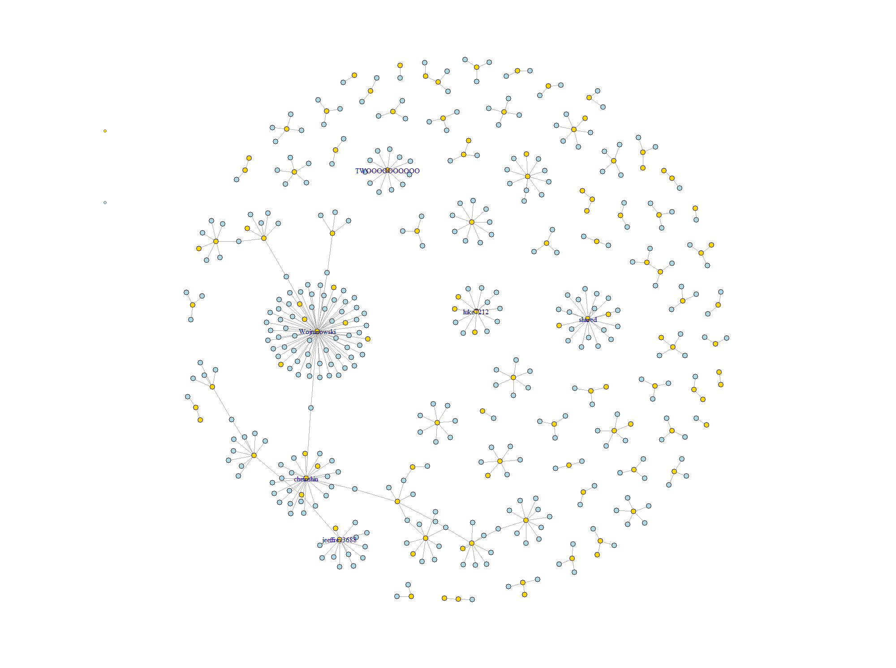  
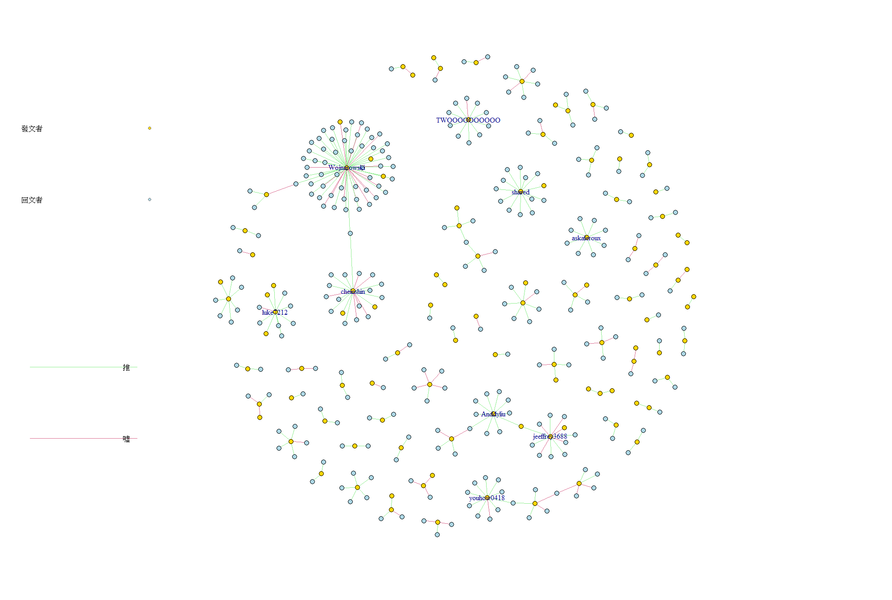 
  
  
> 因為綠營支持者在回覆或發布消息時，支持蔡英文和賴清德會有所重疊，故賴清德的社群網路圖中，前幾名的意見領袖雖然會提及賴清德，但某些帳號經對比之後，較為支持小英(如Wojnarowski、TWOOOOOOOOOO等)，故分別抓出幾名較為支持賴清德的意見領袖作比較分析。  

> 我們抓出三名意見領袖：shared、youhow0418、luke7212  
> 雖然社群網路較為分散，但群體之間仍有一定程度連結，以上抓出帳號，不一定發文數或回應數最多，但相對其他帳號較能激起社群討論，引導風向。


### 意見領袖的特質  

如發文內容、情緒、頻率

## 頻率
```{r}
# 一號(這五個月發了51次文)
li_leader1 = li %>% filter(artPoster=="shared")
summary(li_leader1)
li_leader1$artDate = as.Date(li_leader1$artDate)
li_leader1= li_leader1 %>% mutate(months = as.Date(cut(artDate, "months")))
li_leader1time = li_leader1 %>%group_by(months) %>%
  summarise(num=n()) %>% as.data.frame %>%  
  mutate( poster ="shared" ) 

#二號(這五個月發了25次文)
li_leader2 = li %>% filter(artPoster=="youhow0418")

summary(li_leader2)
li_leader2$artDate = as.Date(li_leader2$artDate)
li_leader2= li_leader2 %>% mutate(months = as.Date(cut(artDate, "months")))
li_leader2time = li_leader2 %>%group_by(months) %>%
  summarise(num=n()) %>%
  as.data.frame%>%  
  mutate( poster ="youhow0418" ) 

#三號(這五個月發了16次文)
li_leader3 = li %>% filter(artPoster=="luke7212")

summary(li_leader3)
li_leader3$artDate = as.Date(li_leader3$artDate)
li_leader3= li_leader3 %>% mutate(months = as.Date(cut(artDate, "months")))
li_leader3time = li_leader3 %>%group_by(months) %>%
  summarise(num=n()) %>%
  as.data.frame%>%  
  mutate( poster ="luke7212" ) 

# 整合他們的發文趨勢圖
li_leader = rbind(li_leader1time,li_leader2time,li_leader3time)
li_leader %>% ggplot(aes(x= months,y=num,fill=poster))  +geom_bar(stat = "identity")+
  facet_wrap(~poster, ncol = 2, scales = "fixed") 

```
    
    
> 從圖中可以發現，三名發文者隨月份有越來越常發文的趨勢，特別集中於四月與五月，估計因逼近民進黨黨內初選，讓賴清德討論熱度升高，也為明年年初的總統大選做準備。  
> 接下來進行下一步的內容分析。


## 內容文字雲  
先從發文量明顯大於其他的前三位進行內容分析。

```{r}
# 一號
# 先做斷句（以全形或半形驚歎號、問號、分號以及句號爲依據進行斷句）
devotion_sentences <- strsplit(li_leader1$sentence,"[。！；？!?;]")

# 將每句句子，與所屬的文章連結配對起來，整理成一個dataframe
devotion_sentences <- data.frame(
  id = rep(li_leader1$artUrl,sapply(devotion_sentences, length)), 
  sentence = unlist(devotion_sentences)) %>%
  filter(!str_detect(sentence, regex("^(\t|\n| )*$")))
devotion_sentences$sentence <- as.character(devotion_sentences$sentence)

# 使用斷詞引擎，放入要用的詞典和停用字
jieba_tokenizer = worker(user="dict/use_dict.txt", stop_word = "dict/stop_word.txt",write = "NOFILE")
chi_tokenizer <- function(t) {
  lapply(t, function(x) {
    if(nchar(x)>1){
      tokens <- segment(x, jieba_tokenizer)
      tokens <- tokens[nchar(tokens)>1]
      return(tokens)
    }
  })
}


# 進行斷詞，並計算各詞彙在各文章中出現的次數
devotion_words <- devotion_sentences %>%
  unnest_tokens(word, sentence, token=chi_tokenizer) %>%
  filter(!str_detect(word, regex("[0-9a-zA-Z]"))) %>%
  count(id, word, sort = TRUE)
# devotion_words %>%
#   group_by(word) %>%
#   summarise(sum = n())%>%
#   filter(sum>3)  %>%
#   arrange(desc(sum)) %>% wordcloud2(minSize = 3)

# 二號
# 先做斷句（以全形或半形驚歎號、問號、分號以及句號爲依據進行斷句）
devotion_sentences <- strsplit(li_leader2$sentence,"[。！；？!?;]")

# 將每句句子，與所屬的文章連結配對起來，整理成一個dataframe
devotion_sentences <- data.frame(
  id = rep(li_leader2$artUrl,sapply(devotion_sentences, length)), 
  sentence = unlist(devotion_sentences)) %>%
  filter(!str_detect(sentence, regex("^(\t|\n| )*$")))
devotion_sentences$sentence <- as.character(devotion_sentences$sentence)

# 使用斷詞引擎，放入要用的詞典和停用字
jieba_tokenizer = worker(user="dict/use_dict.txt", stop_word = "dict/stop_word.txt",write = "NOFILE")
chi_tokenizer <- function(t) {
  lapply(t, function(x) {
    if(nchar(x)>1){
      tokens <- segment(x, jieba_tokenizer)
      tokens <- tokens[nchar(tokens)>1]
      return(tokens)
    }
  })
}


# 進行斷詞，並計算各詞彙在各文章中出現的次數
devotion_words <- devotion_sentences %>%
  unnest_tokens(word, sentence, token=chi_tokenizer) %>%
  filter(!str_detect(word, regex("[0-9a-zA-Z]"))) %>%
  count(id, word, sort = TRUE)
# devotion_words %>%
#  group_by(word) %>%
#   summarise(sum = n())%>%
#   filter(sum>3)  %>%
#   arrange(desc(sum)) %>% wordcloud2(minSize = 3)


# 三號
# 先做斷句（以全形或半形驚歎號、問號、分號以及句號爲依據進行斷句）
devotion_sentences <- strsplit(li_leader3$sentence,"[。！；？!?;]")

# 將每句句子，與所屬的文章連結配對起來，整理成一個dataframe
devotion_sentences <- data.frame(
  id = rep(li_leader3$artUrl,sapply(devotion_sentences, length)), 
  sentence = unlist(devotion_sentences)) %>%
  filter(!str_detect(sentence, regex("^(\t|\n| )*$")))
devotion_sentences$sentence <- as.character(devotion_sentences$sentence)

# 使用斷詞引擎，放入要用的詞典和停用字
jieba_tokenizer = worker(user="dict/use_dict.txt", stop_word = "dict/stop_word.txt",write = "NOFILE")
chi_tokenizer <- function(t) {
  lapply(t, function(x) {
    if(nchar(x)>1){
      tokens <- segment(x, jieba_tokenizer)
      tokens <- tokens[nchar(tokens)>1]
      return(tokens)
    }
  })
}


# 進行斷詞，並計算各詞彙在各文章中出現的次數
devotion_words <- devotion_sentences %>%
  unnest_tokens(word, sentence, token=chi_tokenizer) %>%
  filter(!str_detect(word, regex("[0-9a-zA-Z]"))) %>%
  count(id, word, sort = TRUE)

```


   
   
> **shared**：[新聞]、[爆卦]分享者  
> 和Wojnarowski相似，貼文內容以[新聞]轉貼或[爆卦]類文章為主，特別是民調動態，或總統參選局勢為主。故會出現「參選」、「初選」等關鍵字。內容偏向批評蔡英文民調落後、蔡造成執政前期民進黨支持度下降，或是以專家斷言方式支持賴清德出選。 

  

> **youhow0418**：[新聞]分享者 　  
> 分享內容為新聞轉貼居多，內容與shared相似，但兼著重賴清德的拉抬與對蔡英文的質疑，如賴清德民調領先、蔡英文對華航罷工的處理等。    
  
    

> **luke7212**：[臉書]、[新聞]分享者  
> 發文數較少，主要在臉書貼文分享，或新聞轉貼，對賴清德的支持風向沒那麼明顯，比較偏向蔡、賴兩個都支持，而肯定賴清德的施政成績。  
  

> 從上述分析可以發現，以上三位帳號發文多以臉書貼文、新聞轉貼，或民調等強烈政黨暗示的貼文為主，而幾乎無個人意見的抒發或評論，推估爭議性新聞較容易引發網民迴響，接著分析其情緒組成。  


## 情緒
```{r warning=FALSE}
# 載入stop words字典
stop_words <- read_file("dict/stop_word.txt")
stop_words <- strsplit(stop_words, "[\r]")[[1]]
stop_words <- data.frame(word = stop_words)
colnames(stop_words) = c("word")
stop_words <- read_file("dict/stop_word.txt")
stop_words <- strsplit(stop_words, "[\r]")[[1]]

# 載入negation words字典

negation_words = c("不是","不","未","未必","毫不","決不","沒有","沒","還沒有","還沒","還不","從來沒有","從來沒","從來不","從不","非","不會","不要","不行","無法")

# 把stop words中的negation words移掉
stop_words <- stop_words[!(stop_words %in% negation_words)]

# 載入斷詞字典
use_dict <- read_file("dict/use_dict.txt")
use_dict <- strsplit(use_dict, "[\r]")[[1]]
use_dict<- data.frame(word = use_dict)
colnames(use_dict) = c("nega_word")
use_dict <- read_file("dict/use_dict.txt")
use_dict <- strsplit(use_dict, "[\r]")[[1]]

# 載入liwc情緒字典
p <- read_file("dict/liwc/positive.txt")
n <- read_file("dict/liwc/negative.txt")
positive <- strsplit(p, "[,]")[[1]]
negative <- strsplit(n, "[,]")[[1]]
positive <- data.frame(word = positive, sentiments = "positive")
negative <- data.frame(word = negative, sentiemtns = "negative")
colnames(negative) = c("word","sentiment")
colnames(positive) = c("word","sentiment")
LIWC_ch <- rbind(positive, negative)
p <- read_file("dict/liwc/positive.txt")
n <- read_file("dict/liwc/negative.txt")
positive <- strsplit(p, "[,]")[[1]]
negative <- strsplit(n, "[,]")[[1]]


# 這裏不加入stop word字典(清掉的話會影響bigram結果)
jieba_tokenizer = worker()

# 使用字典重新斷詞，把否定詞也加入斷詞
new_user_word(jieba_tokenizer, c(use_dict,negation_words))

# unnest_tokens 使用的bigram分詞函數，並執行bigram分詞
jieba_bigram <- function(t) {
  lapply(t, function(x) {
    if(nchar(x)>1){
      tokens <- segment(x, jieba_tokenizer)
      bigram<- ngrams(unlist(tokens), 2)
      bigram <- lapply(bigram, paste, collapse = " ")
      unlist(bigram)
    }
  })
}

li_3 = li %>% filter(artPoster=="shared"|artPoster=="youhow0418"|artPoster=="luke7212")
devotion_bigram <- li_3 %>%
  unnest_tokens(bigram,sentence, token = jieba_bigram)

# # 將bigram拆成word1和word2，並將包含英文字母或和數字的詞彙清除
# bigrams_separated <- devotion_bigram %>%
#   filter(!str_detect(bigram, regex("[0-9a-zA-Z]"))) %>%
#   separate(bigram, c("word1", "word2"), sep = " ")
# 
# # 並選出word2爲情緒詞的bigram
# devotion_sentiment_bigrams <- bigrams_separated %>%
#   filter(!word1 %in% stop_words) %>%
#   filter(!word2 %in% stop_words) %>%
#   inner_join(LIWC_ch, by = c(word2 = "word"))   
# 
# # 選出word2中，有出現在情緒詞典中的詞彙
# # 如果是正面詞彙則賦予： 情緒標籤爲"positive"、情緒值爲  1
# # 如果是負面詞彙則賦予： 情緒標籤爲"negative"、情緒值爲 -1
# devotion_sentiment_bigrams1 <- devotion_sentiment_bigrams %>%
#   select(artUrl,artDate,artPoster, word1, word2) %>%
#   mutate(sentiment=ifelse(word2 %in% positive,1,-1), sentiment_tag=ifelse(word2 %in% positive, "positive", "negative"))
# 
# # 生成一個時間段中的 日期和情緒標籤的所有可能組合
# all_dates <- 
#   expand.grid(seq(as.Date(min(devotion_sentiment_bigrams1$artDate)), as.Date(max(devotion_sentiment_bigrams1$artDate)), by="day"), c("positive", "negative"))
# names(all_dates) <- c("artDate", "sentiment")
# 
# # 反轉前面是否定詞且後面爲情緒詞彙的組合
# 
# devotion_sentiment_bigrams_negated <- devotion_sentiment_bigrams1 %>%
#   mutate(sentiment=ifelse(word1 %in% negation_words, (-1)*sentiment, sentiment)) %>%
#   mutate(sentiment_tag=ifelse(sentiment>0, "positive", "negative"))
# 
# # 計算我們資料集中每日的情緒值
# negated_sentiment_plot_data <- devotion_sentiment_bigrams_negated %>%
#   group_by(artUrl,artDate,artPoster,sentiment_tag,sentiment) %>%
#   summarise(count=n())  
# 
# # 將所有 "日期與情緒值的所有可能組合" 與 "每日的情緒值" join起來
# # 如果資料集中某些日期沒有文章或情緒值，會出現NA
# # 我們用0取代NA
# negated_sentiment_plot_data <- all_dates %>% 
#   merge(negated_sentiment_plot_data,by.x=c('artDate', "sentiment"),by.y=c("artDate", "sentiment_tag"),
#         all.x=T,all.y=T) %>% 
#   mutate(count = replace_na(count, 0))
# 
# # 最後把圖畫出來
# negated_sentiment_plot_data=negated_sentiment_plot_data %>%
#   mutate(sentiment.y = replace_na(sentiment.y, 0)) %>%
#   mutate(count1 = sentiment.y * count)
# 
# negated_sentiment_plot_data1 =negated_sentiment_plot_data %>%filter(!is.na(artPoster))
# negated_sentiment_plot_data1 %>%
#   ggplot(aes(artDate,count1,fill=sentiment)) +
#   geom_col(show.legend = FALSE) +
#   facet_wrap(~ artPoster, scales = "fixed") +
#   scale_x_date(labels = date_format("%m-%d"))
```
  
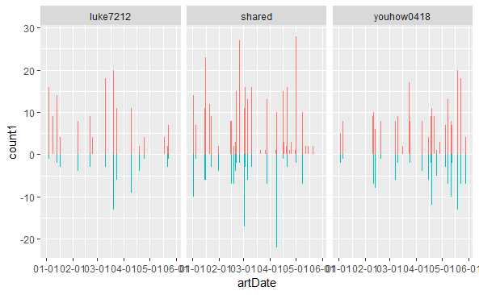  
  
> 三名意見領袖：shared、youhow0418、luke7212   
>  
> **shared** 文章攻擊性較強，較常出現情緒性字眼，以爭議性[新聞]、[爆卦]為主，大比例分享民調動態，也因發文量大，情緒分布較為密集，單篇正負情緒也較極端。   
>  
> **youhow0418** 和shared相似，分享內容情緒強烈，特別是抨擊蔡英文施政的部分，也因多為爭議性新聞而正負面情緒都相當高。  
>  
> **luke7212** 發文量少，情緒分布較為分散，多為新聞或臉書正向肯定的內容居多，偶爾提到負面情緒字眼，以正面情緒為主。  
  
> 對照關聯圖，shared、youhow0418、luke7212，雖然發文頻率不同，但整體多為推文為主，顯示其言論雖情緒起伏較大，但獲相同觀點的網友廣泛支持。但相較其他發文量較小的意見領袖，招致的噓文也較多。

  
# 蔡英文的的ptt社群網絡領袖分析  

## 找出蔡英文的ptt意見領袖

### 整理並標記
```{r}
# 選出需要的欄位
tsai_r <- tsai_r[,c(4,7,8,10)]
colnames(tsai_r)=c("artUrl", "cmtPoster", "cmtStatus"," cmtContent")
# 發文者數量 1590
length(unique(tsai$artPoster))
# 回覆者數量 38685
length(unique(tsai_r$cmtPoster))
# 總共有參與的人數 39115
allPoster <- c(tsai$artPoster, tsai_r$cmtPoster)
length(unique(allPoster)) #去掉重複
```

```{r}
# 整理所有出現過的使用者
# 如果曾發過文的話就標註他爲poster；沒有發過文的話則標註他爲replyer
userList <- data.frame(user=unique(allPoster)) %>%
              mutate(type=ifelse(user%in%tsai$artPoster, "poster", "replyer"))
```

### 建立社群網路圖
```{r}
# 把評論和文章依據artUrl innerJoin起來
tsai_all <- merge(x = tsai, y = tsai_r, by = "artUrl")

# 取出 cmtPoster(回覆者)、artPoster(發文者)、artUrl(文章連結) 三個欄位
link <- tsai_all %>%
      dplyr::select(cmtPoster, artPoster, artUrl)
# 這個順序是因為graph_from_data_frame 有規定(若有方向)第一個欄位是from 第二個欄位是to, 後面的欄位就是描述這個關係的東西

# 建立網路關係
net <- graph_from_data_frame(d=link, directed=T)

```
  
> 因網路評論人數眾多，設定發文數大於5，回覆則數500以上，社群degree大於5，才會納入圖片討論。


### 縮小範圍  
篩掉4546，留下250個帳號
```{r}
# 篩選回應數和發文次數
table(tsai$commentNum>=500)
tsai_poster=table(tsai$artPoster) %>% sort %>% as.data.frame 
colnames(tsai_poster)=c("artPoster","freq")
tsai_poster=tsai_poster %>% filter(freq>=5) 

link <- tsai_all %>%
  filter(commentNum >=500) %>% #回應數大於500則
  filter(artPoster==tsai_poster$artPoster) %>% #發文次數>=5次
 # filter(cmtStatus!="→") %>%  # ptt篩出推噓
      select(cmtPoster, artPoster, artUrl, cmtStatus) 

# 這邊要篩選link中有出現的使用者(否則沒有在link中出現的使用者也會被igraph畫上去，沒有意義)
filtered_user <- userList %>%
          filter(user%in%link$cmtPoster | user%in%link$artPoster) %>% 
          arrange(desc(type))
```


### 畫出關聯圖
```{r}
# # 建立網路關係
# set.seed(487)
# net <- graph_from_data_frame(d=link, v=filtered_user, directed=F)
# # DEGREE大於20 將印出LABEL否則則無
# labels <- degree(net)
# V(net)$label <- names(labels)
# V(net)$color <- ifelse(V(net)$type=="poster", "gold", "lightblue")
# 
# # 依據回覆發生的文章所對應的主題，對他們的關聯線進行上色
# E(net)$color <- ifelse(E(net)$cmtStatus == "推", "lightgreen", "palevioletred")
# 
#   plot(net, vertex.size=2, edge.arrow.size=.2,
#        vertex.label=ifelse(degree(net) > 10, V(net)$label, NA),  vertex.label.ces=.5)
# # 加入標示
#   legend(x=-1.5, y=1, c("發文者","回文者"), pch=21,
#          col="#777777", pt.bg=c("gold","lightblue"), pt.cex=1,cex=1,text.width=1,x.intersp=-2,adj=1,y.intersp=1,bty="n")
# 
# legend(x=-2, y=0, c("推","噓"),
#         col=c("lightgreen","palevioletred"), lty=1, cex=1,
#         text.width=3,x.intersp=0,adj=2,y.intersp=1,bty="n")
```
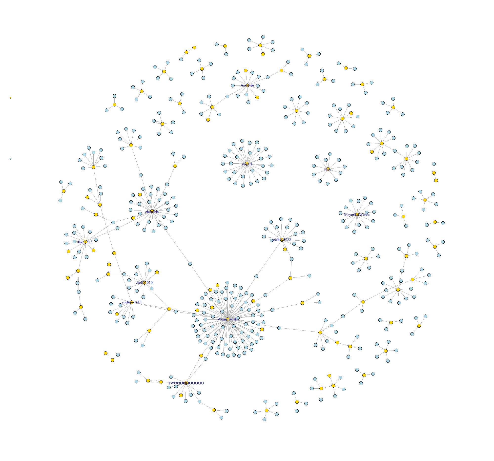  

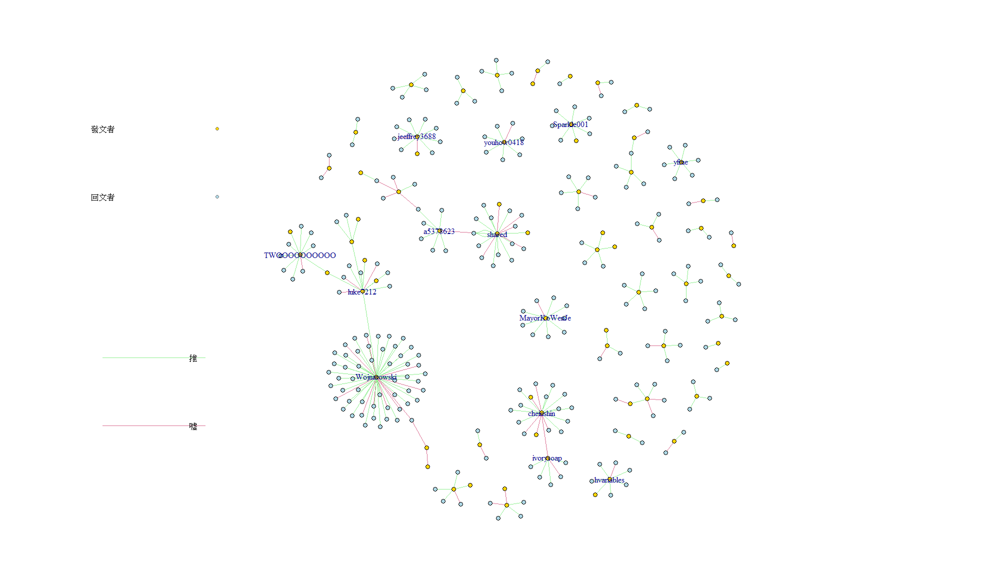   

  
> 我們抓出前三名意見領袖：Wojnarowski、cheinshin、TWOOOOOOOOOO  
  
> 蔡英文與賴清德網路社群分布情況類似，其中有部分帳號重疊，如Wojnarowski、shared、TWOOOOOOOOOO，推估可能因對民進黨關心者皆會提及兩者消息動態，只是在兩邊社群分布角色不同。  


### 意見領袖的特質  

如發文內容、情緒、頻率

## 頻率
```{r}
# 一號(這5個月發了96次文)
tsai_leader1 = tsai %>% filter(artPoster=="Wojnarowski")
summary(tsai_leader1)
tsai_leader1$artDate = as.Date(tsai_leader1$artDate)
tsai_leader1= tsai_leader1 %>% mutate(months = as.Date(cut(artDate, "months")))
tsai_leader1time = tsai_leader1 %>%group_by(months) %>%
  summarise(num=n()) %>% as.data.frame %>%  
  mutate( poster ="Wojnarowski" ) 


# 二號(這5個月發了44次文)
tsai_leader2 = tsai %>% filter(artPoster=="cheinshin")
summary(tsai_leader2)
tsai_leader2$artDate = as.Date(tsai_leader2$artDate)
tsai_leader2= tsai_leader2 %>% mutate(months = as.Date(cut(artDate, "months")))
tsai_leader2time = tsai_leader2 %>%group_by(months) %>%
  summarise( num=n()) %>%
  as.data.frame%>%  
  mutate( poster ="cheinshin" ) 

#三號(這5個月發了27次文)
tsai_leader3 = tsai %>% filter(artPoster=="TWOOOOOOOOOO")
summary(tsai_leader3)
tsai_leader3$artDate = as.Date(tsai_leader3$artDate)
tsai_leader3= tsai_leader3 %>% mutate(months = as.Date(cut(artDate, "months")))
tsai_leader3time = tsai_leader3 %>%group_by(months) %>%
  summarise(num=n()) %>%
  as.data.frame%>%  
  mutate( poster ="TWOOOOOOOOOO" ) 

# 整合他們的發文趨勢圖
tsai_leader = rbind(tsai_leader1time,tsai_leader2time,tsai_leader3time)

tsai_leader %>% ggplot(aes(x= months,y=num,fill=poster))  +geom_bar(stat = "identity")+
  facet_wrap(~poster, ncol = 2, scales = "free") 
```
  
  
  
> 從圖中可以發現，在三名的發文者中。Wojnarowski、cheinshin、TWOOOOOOOOOO發文頻率幾乎從二月開始明顯上升，但較為分散，沒有特別集中哪幾個月份的趨勢，其中TWOOOOOOOOOO發文頻率隨月份越來越高，可能因為接近選舉，網路討論熱度上升所致。


## 內容文字雲
```{r}
# 一號
# 先做斷句（以全形或半形驚歎號、問號、分號以及句號爲依據進行斷句）
devotion_sentences <- strsplit(tsai_leader1$sentence,"[。！；？!?;]")

# 將每句句子，與所屬的文章連結配對起來，整理成一個dataframe
devotion_sentences <- data.frame(
  id = rep(tsai_leader1$artUrl,sapply(devotion_sentences, length)), 
  sentence = unlist(devotion_sentences)) %>%
  filter(!str_detect(sentence, regex("^(\t|\n| )*$")))
devotion_sentences$sentence <- as.character(devotion_sentences$sentence)

# 使用斷詞引擎，放入要用的詞典和停用字
jieba_tokenizer = worker(user="dict/use_dict.txt", stop_word = "dict/stop_word.txt",write = "NOFILE")
chi_tokenizer <- function(t) {
  lapply(t, function(x) {
    if(nchar(x)>1){
      tokens <- segment(x, jieba_tokenizer)
      tokens <- tokens[nchar(tokens)>1]
      return(tokens)
    }
  })
}


# 進行斷詞，並計算各詞彙在各文章中出現的次數
devotion_words <- devotion_sentences %>%
  unnest_tokens(word, sentence, token=chi_tokenizer) %>%
  filter(!str_detect(word, regex("[0-9a-zA-Z]"))) %>%
  count(id, word, sort = TRUE)
 # devotion_words %>%
 #   group_by(word) %>%
 #   summarise(sum = n())%>%
 #   filter(sum>3)  %>%
 #   arrange(desc(sum)) %>% wordcloud2(minSize = 3)

# 二號
# 先做斷句（以全形或半形驚歎號、問號、分號以及句號爲依據進行斷句）
devotion_sentences <- strsplit(tsai_leader2$sentence,"[。！；？!?;]")

# 將每句句子，與所屬的文章連結配對起來，整理成一個dataframe
devotion_sentences <- data.frame(
  id = rep(tsai_leader2$artUrl,sapply(devotion_sentences, length)), 
  sentence = unlist(devotion_sentences)) %>%
  filter(!str_detect(sentence, regex("^(\t|\n| )*$")))
devotion_sentences$sentence <- as.character(devotion_sentences$sentence)

# 使用斷詞引擎，放入要用的詞典和停用字
jieba_tokenizer = worker(user="dict/use_dict.txt", stop_word = "dict/stop_word.txt",write = "NOFILE")
chi_tokenizer <- function(t) {
  lapply(t, function(x) {
    if(nchar(x)>1){
      tokens <- segment(x, jieba_tokenizer)
      tokens <- tokens[nchar(tokens)>1]
      return(tokens)
    }
  })
}


# 進行斷詞，並計算各詞彙在各文章中出現的次數
devotion_words <- devotion_sentences %>%
  unnest_tokens(word, sentence, token=chi_tokenizer) %>%
  filter(!str_detect(word, regex("[0-9a-zA-Z]"))) %>%
  count(id, word, sort = TRUE)
 # devotion_words %>%
 #   group_by(word) %>%
 #   summarise(sum = n())%>%
 #   filter(sum>2)  %>%
 #   arrange(desc(sum)) %>% wordcloud2(minSize = 3)


# 三號
# 先做斷句（以全形或半形驚歎號、問號、分號以及句號爲依據進行斷句）
devotion_sentences <- strsplit(tsai_leader3$sentence,"[。！；？!?;]")

# 將每句句子，與所屬的文章連結配對起來，整理成一個dataframe
devotion_sentences <- data.frame(
  id = rep(tsai_leader3$artUrl,sapply(devotion_sentences, length)), 
  sentence = unlist(devotion_sentences)) %>%
  filter(!str_detect(sentence, regex("^(\t|\n| )*$")))
devotion_sentences$sentence <- as.character(devotion_sentences$sentence)

# 使用斷詞引擎，放入要用的詞典和停用字
jieba_tokenizer = worker(user="dict/use_dict.txt", stop_word = "dict/stop_word.txt",write = "NOFILE")
chi_tokenizer <- function(t) {
  lapply(t, function(x) {
    if(nchar(x)>1){
      tokens <- segment(x, jieba_tokenizer)
      tokens <- tokens[nchar(tokens)>1]
      return(tokens)
    }
  })
}

# 進行斷詞，並計算各詞彙在各文章中出現的次數
devotion_words <- devotion_sentences %>%
  unnest_tokens(word, sentence, token=chi_tokenizer) %>%
  filter(!str_detect(word, regex("[0-9a-zA-Z]"))) %>%
  count(id, word, sort = TRUE)

# devotion_words %>%
#   group_by(word) %>%
#   summarise(sum = n())%>%
#   filter(sum>2)  %>%
#   arrange(desc(sum)) %>% wordcloud2(minSize = 3)

```

  
  
> Wojnarowski(96)：[新聞]分享者 
> 大部分是新聞報導，或者是轉貼蔡英文的臉書貼文居多，分享內容多元。包含蔡英文的外交政策(反對一國兩制、友邦交流)、施政成效上的宣傳、探訪國軍等視察活動，對韓國瑜政策的批評，甚至還有到嘉義吃虎兒油飯等較為輕鬆的臉書轉貼。  

    
  
> cheinshin(44)：[臉書]、[新聞]分享者  
> 以臉書貼文、新聞分享為主，其中又以蔡英文臉書居多，分享的內容在一般關注的台美政策、選舉相關新聞外，也加入地方視察等較不容易見報的總統行程，或是提醒勿信line假消息等動態，有蔡英文臉書傳聲筒意味。  

  
  
> TWOOOOOOOOOO(27):[新聞]分享者   
> 發布的貼文清一色為其他新聞媒體，內容著重在其他政黨對蔡英文政策批評的相關報導，如外交政策、九二共識、國內施政成效等，正反皆會評論。估計因其轉貼內容較有爭議性故引發較多迴響。


> 接著來看看發文者的用詞情緒下手

## 情緒
```{r warning=FALSE}
# 載入stop words字典
stop_words <- read_file("dict/stop_word.txt")
stop_words <- strsplit(stop_words, "[\r]")[[1]]
stop_words <- data.frame(word = stop_words)
colnames(stop_words) = c("word")
stop_words <- read_file("dict/stop_word.txt")
stop_words <- strsplit(stop_words, "[\r]")[[1]]

# 載入negation words字典

negation_words = c("不是","不","未","未必","毫不","決不","沒有","沒","還沒有","還沒","還不","從來沒有","從來沒","從來不","從不","非","不會","不要","不行","無法")

# 把stop words中的negation words移掉
stop_words <- stop_words[!(stop_words %in% negation_words)]

# 載入斷詞字典
use_dict <- read_file("dict/use_dict.txt")
use_dict <- strsplit(use_dict, "[\r]")[[1]]
use_dict<- data.frame(word = use_dict)
colnames(use_dict) = c("nega_word")
use_dict <- read_file("dict/use_dict.txt")
use_dict <- strsplit(use_dict, "[\r]")[[1]]

# 載入liwc情緒字典
p <- read_file("dict/liwc/positive.txt")
n <- read_file("dict/liwc/negative.txt")
positive <- strsplit(p, "[,]")[[1]]
negative <- strsplit(n, "[,]")[[1]]
positive <- data.frame(word = positive, sentiments = "positive")
negative <- data.frame(word = negative, sentiemtns = "negative")
colnames(negative) = c("word","sentiment")
colnames(positive) = c("word","sentiment")
LIWC_ch <- rbind(positive, negative)

p <- read_file("dict/liwc/positive.txt")
n <- read_file("dict/liwc/negative.txt")
positive <- strsplit(p, "[,]")[[1]]
negative <- strsplit(n, "[,]")[[1]]


# 這裏不加入stop word字典(清掉的話會影響bigram結果)
jieba_tokenizer = worker()

# 使用還願字典重新斷詞，把否定詞也加入斷詞
new_user_word(jieba_tokenizer, c(use_dict,negation_words))

# unnest_tokens 使用的bigram分詞函數，並執行bigram分詞
jieba_bigram <- function(t) {
  lapply(t, function(x) {
    if(nchar(x)>1){
      tokens <- segment(x, jieba_tokenizer)
      bigram<- ngrams(unlist(tokens), 2)
      bigram <- lapply(bigram, paste, collapse = " ")
      unlist(bigram)
    }
  })
}

tsai_3 = tsai %>% filter(artPoster=="Wojnarowski"|artPoster=="cheinshin"|artPoster=="TWOOOOOOOOOO")
devotion_bigram <- tsai_3 %>%
  unnest_tokens(bigram,sentence, token = jieba_bigram)

# # 將bigram拆成word1和word2，並將包含英文字母或和數字的詞彙清除
# bigrams_separated <- devotion_bigram %>%
#   filter(!str_detect(bigram, regex("[0-9a-zA-Z]"))) %>%
#   separate(bigram, c("word1", "word2"), sep = " ")
# 
# # 並選出word2爲情緒詞的bigram
# devotion_sentiment_bigrams <- bigrams_separated %>%
#   filter(!word1 %in% stop_words) %>%
#   filter(!word2 %in% stop_words) %>%
#   inner_join(LIWC_ch, by = c(word2 = "word"))   
# 
# # 選出word2中，有出現在情緒詞典中的詞彙
# # 如果是正面詞彙則賦予： 情緒標籤爲"positive"、情緒值爲  1
# # 如果是負面詞彙則賦予： 情緒標籤爲"negative"、情緒值爲 -1
# devotion_sentiment_bigrams1 <- devotion_sentiment_bigrams %>%
#   select(artUrl,artDate,artPoster, word1, word2) %>%
#   mutate(sentiment=ifelse(word2 %in% positive,1,-1), sentiment_tag=ifelse(word2 %in% positive, "positive", "negative"))
# 
# # 生成一個時間段中的 日期和情緒標籤的所有可能組合
# all_dates <- 
#   expand.grid(seq(as.Date(min(devotion_sentiment_bigrams1$artDate)), as.Date(max(devotion_sentiment_bigrams1$artDate)), by="day"), c("positive", "negative"))
# names(all_dates) <- c("artDate", "sentiment")
# 
# # 反轉前面是否定詞且後面爲情緒詞彙的組合
# 
# devotion_sentiment_bigrams_negated <- devotion_sentiment_bigrams1 %>%
#   mutate(sentiment=ifelse(word1 %in% negation_words, (-1)*sentiment, sentiment)) %>%
#   mutate(sentiment_tag=ifelse(sentiment>0, "positive", "negative"))
# 
# # 計算我們資料集中每日的情緒值
# negated_sentiment_plot_data <- devotion_sentiment_bigrams_negated %>%
#   group_by(artUrl,artDate,artPoster,sentiment_tag,sentiment) %>%
#   summarise(count=n())  
# 
# # 將所有 "日期與情緒值的所有可能組合" 與 "每日的情緒值" join起來
# # 如果資料集中某些日期沒有文章或情緒值，會出現NA
# # 我們用0取代NA
# negated_sentiment_plot_data <- all_dates %>% 
#   merge(negated_sentiment_plot_data,by.x=c('artDate', "sentiment"),by.y=c("artDate", "sentiment_tag"),
#         all.x=T,all.y=T) %>% 
#   mutate(count = replace_na(count, 0))
# 
# # 最後把圖畫出來
# negated_sentiment_plot_data=negated_sentiment_plot_data %>%
#   mutate(sentiment.y = replace_na(sentiment.y, 0)) %>%
#   mutate(count1 = sentiment.y * count)
# 
# negated_sentiment_plot_data1 =negated_sentiment_plot_data %>%filter(!is.na(artPoster))
# negated_sentiment_plot_data1 %>%
#   ggplot(aes(artDate,count1,fill=sentiment)) +
#   geom_col(show.legend = FALSE) +
#   facet_wrap(~ artPoster, scales = "fixed") +
#   scale_x_date(labels = date_format("%m-%d"))
```

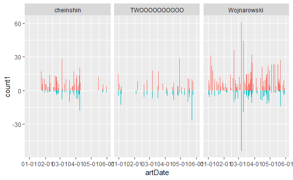     
    
> 三名意見領袖：    
> **Wojnarowski**因發文數高，故情緒分布也較密集，是蔡英文的熱烈粉絲，分享的內容多為蔡英文遭受外界質疑的回應、對特定政策或的批評或說明外交傾向，爭議性內容導致正負面情緒同時增加，另外正面政策宣導使正面情緒上升，總體上是正面大於負面的趨勢。  
> **cheinshin**身為一接近蔡英文臉書傳聲筒的腳色，正面宣傳政績或總統走訪動態的文類居多，故以正面情緒居多。  
> **TWOOOOOOOOOO**發文頻率較少，故情緒分布較不密集，但內容多以爭議性文章居多，故相對情緒分布較為兩極。  
  
  
# 韓國瑜的ptt社群網絡領袖分析  

## 找出韓國瑜的ptt意見領袖  

### 整理並標記
```{r}
han1 <- han1 %>%
      select(artUrl, commentPoster, commentStatus, commentContent)
length(unique(han$artPoster))# 發文者數量2538
length(unique(han1$commentPoster))# 回覆者數量45419
allPoster <- c(han$artPoster, han1$commentPoster)#總共有參與的人數46078
length(unique(allPoster))
```

### 整理資料
```{r}
# 整理所有出現過得使用者
# 如果它曾發過文的話就標註他爲poster
# 如果沒有發過文的話則標註他爲replyer
userList <- data.frame(user=unique(allPoster)) %>%
              mutate(type=ifelse(user%in%han$artPoster, "poster", "replyer"))
# 把評論和文章依據artUrl innerJoin起來
han_all <- merge(x = han, y = han1, by = "artUrl")
```

> 因網路評論人數眾多，設定發文數大於10，回覆則數500以上，才會納入圖片討論。

### 縮小範圍  
篩掉9543個帳號，留下常活動的230個。
```{r}
# 篩選回應數和發文次數
table(han$commentNum>=500)
han_poster=table(han$artPoster) %>% sort %>% as.data.frame 
colnames(han_poster)=c("artPoster","freq")
han_poster=han_poster %>% filter(freq>=10) 

han_link <- han_all %>%
  filter(commentNum >=500) %>% #回應數大於500則
  filter(artPoster==han_poster$artPoster) %>% #發文次數>10次
  filter(commentStatus!="→") %>%  # ptt篩出推噓
      select(commentPoster, artPoster, artUrl, commentStatus) 

# 這邊要篩選link中有出現的使用者(否則沒有在link中出現的使用者也會被igraph畫上去，沒有意義)
han_filtered_user <- userList %>%
          filter(user%in%han_link $commentPoster | user%in%han_link $artPoster) %>% arrange(desc(type))

```


### 畫出關聯圖
```{r}
#  # 建立網路關係
# set.seed(388)
# net <- graph_from_data_frame(d=han_link, v=han_filtered_user, directed=F)
# # DEGREE大於10 將印出LABEL否則則無
# labels <- degree(net)
# V(net)$label <- names(labels)
# 
# V(net)$color <- ifelse(V(net)$type=="poster", "gold", "lightblue")
# # 依據回覆發生的文章所對應的主題，對他們的關聯線進行上色
# E(net)$color <- ifelse(E(net)$commentStatus == "推", "lightgreen", "palevioletred")
# 
# plot(net, vertex.size=2, edge.arrow.size=.2,
#      vertex.label=ifelse(degree(net) > 10, V(net)$label, NA),  vertex.label.ces=.5)
# # 加入標示
# legend(x=-2, y=-0.2, c("發文者","回文者"), pch=21,
#        col="#777777", pt.bg=c("gold","lightblue"), pt.cex=1, cex=2,
#        text.width=0.02,x.intersp=0.7,adj=1,y.intersp=0.1,bty="n")
# legend(x=-2., y=1, c("推","噓"),
#        col=c("lightgreen","palevioletred"), lty=1, cex=2,
#        text.width=0.02,x.intersp=0.7,adj=1,y.intersp=0.1,bty="n")
```

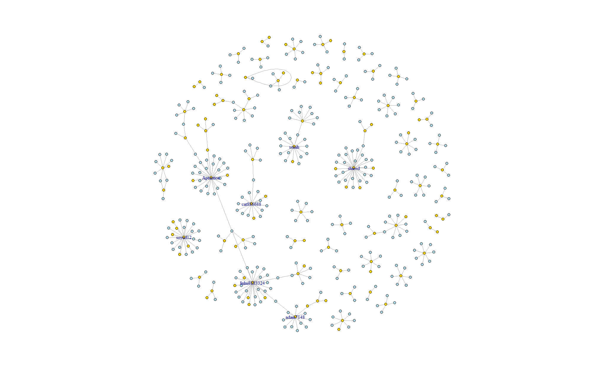   

> 韓國瑜的網路關聯圖，可以發現各集團間較無關聯性，大大小小的集團之間的連結度不高。  

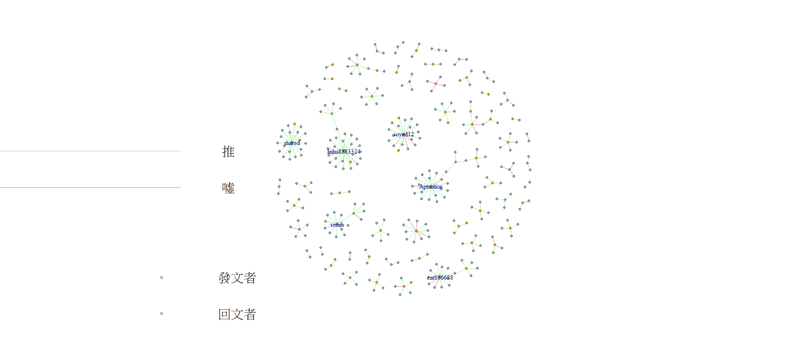  

> 再來我們用Degree(net)大於10的方法篩出來的貼文作者有七個，然後個我們抓出前三名意見領袖(degree(net)前三名)：linhu8883324、Aptantion、shared。


### 意見領袖的特質  

如發文內容、情緒、頻率

## 頻率
```{r}
# 一號(這五個月發了72次文)
han_leader1 = han %>% filter(artPoster=="linhu8883324")
summary(han_leader1)
han_leader1$artDate = as.Date(han_leader1$artDate)
han_leader1= han_leader1 %>% mutate(months = as.Date(cut(artDate, "months")))
han_leader1time = han_leader1 %>%group_by(months) %>%
  summarise(num=n()) %>% as.data.frame %>%  
  mutate( poster ="linhu8883324" ) 


# 二號(這五個月發了10次文)
han_leader2 = han %>% filter(artPoster=="Aptantion")
summary(han_leader2)
han_leader2$artDate = as.Date(han_leader2$artDate)
han_leader2= han_leader2 %>% mutate(months = as.Date(cut(artDate, "months")))
han_leader2time = han_leader2 %>%group_by(months) %>%
  summarise(num=n()) %>% as.data.frame %>%  
  mutate( poster ="Aptantion" ) 

#三號(這五個月發了36次文)
han_leader3 = han %>% filter(artPoster=="shared")
summary(han_leader3)
han_leader3$artDate = as.Date(han_leader3$artDate)
han_leader3= han_leader3 %>% mutate(months = as.Date(cut(artDate, "months")))
han_leader3time = han_leader3 %>%group_by(months) %>%
  summarise(num=n()) %>% as.data.frame %>%  
  mutate( poster ="shared" ) 

# 整合他們的發文趨勢圖
han_leader = rbind(han_leader1time,han_leader2time,han_leader3time)
han_leader %>% ggplot(aes(x= months,y=num,fill=poster))  +geom_bar(stat = "identity")+
  facet_wrap(~poster, ncol = 2, scales = "free") 

```
  
  
> 首先來看degree前三名中的linhu8883324這個帳號，總發文數72篇，五月發最多篇，再來是Aptantion，總發文數10篇，發文數量很少卻有很多連結，是很不可思議的，而且月貼文都是兩篇，很有規律，最後是shared，總發文數36篇，貼文規律地往上增加。

## 內容文字雲
```{r}
# 一號
# 先做斷句（以全形或半形驚歎號、問號、分號以及句號爲依據進行斷句）
devotion_sentences <- strsplit(han_leader1$sentence,"[。！；？!?;]")

# 將每句句子，與所屬的文章連結配對起來，整理成一個dataframe
devotion_sentences <- data.frame(
  id = rep(han_leader1$artUrl,sapply(devotion_sentences, length)), 
  sentence = unlist(devotion_sentences)) %>%
  filter(!str_detect(sentence, regex("^(\t|\n| )*$")))
devotion_sentences$sentence <- as.character(devotion_sentences$sentence)

# 使用斷詞引擎，放入要用的詞典和停用字
jieba_tokenizer = worker(user="dict/use_dict_2.txt", stop_word = "dict/stop_word_2.txt",write = "NOFILE")
chi_tokenizer <- function(t) {
  lapply(t, function(x) {
    if(nchar(x)>1){
      tokens <- segment(x, jieba_tokenizer)
      tokens <- tokens[nchar(tokens)>1]
      return(tokens)
    }
  })
}


# 進行斷詞，並計算各詞彙在各文章中出現的次數
devotion_words <- devotion_sentences %>%
  unnest_tokens(word, sentence, token=chi_tokenizer) %>%
  filter(!str_detect(word, regex("[0-9a-zA-Z]"))) %>%
  count(id, word, sort = TRUE)
# devotion_words %>%
#   group_by(word) %>%
#   summarise(sum = n())%>%
#   filter(sum>3)  %>%
#   arrange(desc(sum))  %>% wordcloud2(minSize = 3)
# 二號
# 先做斷句（以全形或半形驚歎號、問號、分號以及句號爲依據進行斷句）
devotion_sentences <- strsplit(han_leader2$sentence,"[。！；？!?;]")

# 將每句句子，與所屬的文章連結配對起來，整理成一個dataframe
devotion_sentences <- data.frame(
  id = rep(han_leader2$artUrl,sapply(devotion_sentences, length)), 
  sentence = unlist(devotion_sentences)) %>%
  filter(!str_detect(sentence, regex("^(\t|\n| )*$")))
devotion_sentences$sentence <- as.character(devotion_sentences$sentence)

# 使用斷詞引擎，放入要用的詞典和停用字
jieba_tokenizer = worker(user="dict/use_dict_2.txt", stop_word = "dict/stop_word_2.txt",write = "NOFILE")
chi_tokenizer <- function(t) {
  lapply(t, function(x) {
    if(nchar(x)>1){
      tokens <- segment(x, jieba_tokenizer)
      tokens <- tokens[nchar(tokens)>1]
      return(tokens)
    }
  })
}


# 進行斷詞，並計算各詞彙在各文章中出現的次數
devotion_words <- devotion_sentences %>%
  unnest_tokens(word, sentence, token=chi_tokenizer) %>%
  filter(!str_detect(word, regex("[0-9a-zA-Z]"))) %>%
  count(id, word, sort = TRUE)
# devotion_words %>%
#   group_by(word) %>%
#   summarise(sum = n())%>%
#   filter(sum>3)  %>%
#   arrange(desc(sum))  %>% wordcloud2(minSize = 3)

# 三號
# 先做斷句（以全形或半形驚歎號、問號、分號以及句號爲依據進行斷句）
devotion_sentences <- strsplit(han_leader3$sentence,"[。！；？!?;]")

# 將每句句子，與所屬的文章連結配對起來，整理成一個dataframe
devotion_sentences <- data.frame(
  id = rep(han_leader3$artUrl,sapply(devotion_sentences, length)), 
  sentence = unlist(devotion_sentences)) %>%
  filter(!str_detect(sentence, regex("^(\t|\n| )*$")))
devotion_sentences$sentence <- as.character(devotion_sentences$sentence)

# 使用斷詞引擎，放入要用的詞典和停用字
jieba_tokenizer = worker(user="dict/use_dict_2.txt", stop_word = "dict/stop_word_2.txt",write = "NOFILE")
chi_tokenizer <- function(t) {
  lapply(t, function(x) {
    if(nchar(x)>1){
      tokens <- segment(x, jieba_tokenizer)
      tokens <- tokens[nchar(tokens)>1]
      return(tokens)
    }
  })
}


# 進行斷詞，並計算各詞彙在各文章中出現的次數
devotion_words <- devotion_sentences %>%
  unnest_tokens(word, sentence, token=chi_tokenizer) %>%
  filter(!str_detect(word, regex("[0-9a-zA-Z]"))) %>%
  count(id, word, sort = TRUE)
# devotion_words %>%
#   group_by(word) %>%
#   summarise(sum = n())%>%
#   filter(sum>3)  %>%
#   arrange(desc(sum))  %>% wordcloud2(minSize = 3)
```
  
   
  
> **linhu8883324**這個帳號看文字雲很明顯可以看到報導、記者等字，主要是轉貼各新聞網的新聞，但是這個帳號在貼文的最後加個備註，都是在砲轟或是酸韓國瑜的字詞，EX：唬爛、鬼混。EX:韓粉不意外，韓導又在惡搞等等，獲得很大的迴響。平均推數：114、平均噓數：36，都是被推爆的文，可以看出酸韓文在PTT上能獲得很多掌聲。  

     

> **Aptantion**這個帳號主要都是在爆韓國瑜的掛，韓導這個詞是酸韓國瑜都在演戲，所以佔了文字雲很大的版面。平均推數：491、平均噓數：73，由數據可發現，這種爆韓國瑜料的，打擊韓國瑜的文章更受網友喜歡。  
  
  

> **shared**這個帳號在文字雲的表現有個明顯特徵，就是「民調」，這個帳號主要就是在PO各個總統候選人的民調，發文沒有明顯傾向。平均推數：135、平均噓數：45  


## 情緒
```{r warning=FALSE}
# 載入stop words字典
stop_words <- read_file("dict/stop_word_2.txt")
stop_words <- strsplit(stop_words, "[\r]")[[1]]
stop_words <- data.frame(word = stop_words)
colnames(stop_words) = c("word")
stop_words <- read_file("dict/stop_word_2.txt")
stop_words <- strsplit(stop_words, "[\r]")[[1]]

# 載入negation words字典

negation_words = c("不是","不","未","未必","毫不","決不","沒有","沒","還沒有","還沒","還不","從來沒有","從來沒","從來不","從不","非","不會","不要","不行","無法")

# 把stop words中的negation words移掉
stop_words <- stop_words[!(stop_words %in% negation_words)]

# 載入斷詞字典
use_dict <- read_file("dict/use_dict_2.txt")
use_dict <- strsplit(use_dict, "[\r]")[[1]]
use_dict<- data.frame(word = use_dict)
colnames(use_dict) = c("nega_word")
use_dict <- read_file("dict/use_dict_2.txt")
use_dict <- strsplit(use_dict, "[\r]")[[1]]

# 載入liwc情緒字典
p <- read_file("dict/liwc/positive.txt")
n <- read_file("dict/liwc/negative.txt")
positive <- strsplit(p, "[,]")[[1]]
negative <- strsplit(n, "[,]")[[1]]
positive <- data.frame(word = positive, sentiments = "positive")
negative <- data.frame(word = negative, sentiemtns = "negative")
colnames(negative) = c("word","sentiment")
colnames(positive) = c("word","sentiment")
LIWC_ch <- rbind(positive, negative)
p <- read_file("dict/liwc/positive.txt")
n <- read_file("dict/liwc/negative.txt")
positive <- strsplit(p, "[,]")[[1]]
negative <- strsplit(n, "[,]")[[1]]


# 這裏不加入stop word字典(清掉的話會影響bigram結果)
jieba_tokenizer = worker()

# 使用還願字典重新斷詞，把否定詞也加入斷詞
new_user_word(jieba_tokenizer, c(use_dict,negation_words))

# unnest_tokens 使用的bigram分詞函數，並執行bigram分詞
jieba_bigram <- function(t) {
  lapply(t, function(x) {
    if(nchar(x)>1){
      tokens <- segment(x, jieba_tokenizer)
      bigram<- ngrams(unlist(tokens), 2)
      bigram <- lapply(bigram, paste, collapse = " ")
      unlist(bigram)
    }
  })
}

han_3 = han %>% filter(artPoster=="linhu8883324"|artPoster=="Aptantion"|artPoster=="shared")
devotion_bigram <- han_3 %>%
  unnest_tokens(bigram,sentence, token = jieba_bigram)

# # 將bigram拆成word1和word2，並將包含英文字母或和數字的詞彙清除
# bigrams_separated <- devotion_bigram %>%
#   filter(!str_detect(bigram, regex("[0-9a-zA-Z]"))) %>%
#   separate(bigram, c("word1", "word2"), sep = " ")
# 
# # 並選出word2爲情緒詞的bigram
# devotion_sentiment_bigrams <- bigrams_separated %>%
#   filter(!word1 %in% stop_words) %>%
#   filter(!word2 %in% stop_words) %>%
#   inner_join(LIWC_ch, by = c(word2 = "word"))
# 
# # 選出word2中，有出現在情緒詞典中的詞彙
# # 如果是正面詞彙則賦予： 情緒標籤爲"positive"、情緒值爲  1
# # 如果是負面詞彙則賦予： 情緒標籤爲"negative"、情緒值爲 -1
# devotion_sentiment_bigrams1 <- devotion_sentiment_bigrams %>%
#   select(artUrl,artDate,artPoster, word1, word2) %>%
#   mutate(sentiment=ifelse(word2 %in% positive,1,-1), sentiment_tag=ifelse(word2 %in% positive, "positive", "negative"))
# 
# # 生成一個時間段中的 日期和情緒標籤的所有可能組合
# all_dates <-
#   expand.grid(seq(as.Date(min(devotion_sentiment_bigrams1$artDate)), as.Date(max(devotion_sentiment_bigrams1$artDate)), by="day"), c("positive", "negative"))
# names(all_dates) <- c("artDate", "sentiment")
# 
# # 反轉前面是否定詞且後面爲情緒詞彙的組合
# 
# devotion_sentiment_bigrams_negated <- devotion_sentiment_bigrams1 %>%
#   mutate(sentiment=ifelse(word1 %in% negation_words, (-1)*sentiment, sentiment)) %>%
#   mutate(sentiment_tag=ifelse(sentiment>0, "positive", "negative"))
# 
# # 計算我們資料集中每日的情緒值
# negated_sentiment_plot_data <- devotion_sentiment_bigrams_negated %>%
#   group_by(artUrl,artDate,artPoster,sentiment_tag,sentiment) %>%
#   summarise(count=n())
# 
# # 將所有 "日期與情緒值的所有可能組合" 與 "每日的情緒值" join起來
# # 如果資料集中某些日期沒有文章或情緒值，會出現NA
# # 我們用0取代NA
# negated_sentiment_plot_data <- all_dates %>%
#   merge(negated_sentiment_plot_data,by.x=c('artDate', "sentiment"),by.y=c("artDate", "sentiment_tag"),
#         all.x=T,all.y=T) %>%
#   mutate(count = replace_na(count, 0))
# 
# # 最後把圖畫出來
# negated_sentiment_plot_data=negated_sentiment_plot_data %>%
#   mutate(sentiment.y = replace_na(sentiment.y, 0)) %>%
#   mutate(count1 = sentiment.y * count)
# 
# negated_sentiment_plot_data1 =negated_sentiment_plot_data %>%filter(!is.na(artPoster))
# negated_sentiment_plot_data1 %>%
#   ggplot(aes(artDate,count1,fill=sentiment)) +
#   geom_col(show.legend = FALSE) +
#   facet_wrap(~ artPoster, scales = "fixed") +
#   scale_x_date(labels = date_format("%m-%d"))
```

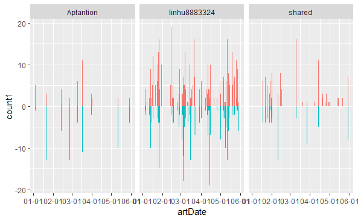       

> 三名意見領袖：Aptantion、linhu8883325、shared  
> **Aptantion**部分，因為他主要PO是爆料韓國瑜的文章，所以情緒詞主要是負面的。  
> **linhu8883325**的文雖然也有正面的分數，但負面的也蠻多；推估正面分數來自新聞文章用詞、負面分數來自他個人的評論。  
> **shared**的情緒詞相較於linhu8883325就沒有那麼多，雖然是比較有情緒用詞的民調，但它本質仍主要是民調，比起新聞文章會再平緩一些。  
> 韓國瑜的三個意見領袖中有兩個反韓領袖，Po文都是在酸韓國瑜，最後一個為貼民調的帳號，無法看出是否挺韓或反韓。由此可知，PTT上的網友對於有關韓國瑜的貼文的反應都不是太正向。  
  

# 朱立倫的ptt社群網絡領袖分析  

## 找出朱立倫的ptt意見領袖  

### 整理並標記
```{r}
# 把評論和文章依據artUrl innerJoin起來
zhu_all <- merge(x = zhu, y = zhu1, by = "artUrl")

allPoster <- c(zhu$artPoster, zhu1$commentPoster)
userList <- data.frame(user=unique(allPoster)) %>%
              mutate(type=ifelse(user%in%zhu$artPoster, "poster", "replyer"))
length(unique(zhu$artPoster))# 發文者數量340
length(unique(zhu1$commentPoster))# 回覆者數量10671
allPoster <- c(zhu$artPoster, zhu1$commentPoster)#總共有參與的人數10845
length(unique(allPoster))
```
  
> 因網路評論人數較少，設定發文數大於10，回覆則數100以上，即納入圖片討論。

### 縮小範圍  
篩掉527個帳號，留下常活動的111個。
```{r}
# 篩選回應數和發文次數
table(zhu$commentNum>=100)
zhu_poster=table(zhu$artPoster) %>% sort %>% as.data.frame 
colnames(zhu_poster)=c("artPoster","freq")
zhu_poster=zhu_poster %>% filter(freq>=10) 

zhu_link <- zhu_all %>%
  filter(commentNum >=100) %>% #回應數大於100則
  filter(artPoster.x==zhu_poster$artPoster) %>% #發文次數>10次
 # filter(commentStatus!="→") %>%  # ptt篩出推噓
      select(commentPoster, artPoster.x, artUrl, commentStatus) 

# 這邊要篩選link中有出現的使用者(否則沒有在link中出現的使用者也會被igraph畫上去，沒有意義)
zhu_filtered_user <- userList %>%
          filter(user%in%zhu_link$commentPoster | user%in%zhu_link$artPoster.x) %>% arrange(desc(type))

```

### 劃出關聯圖
```{r}
#  # 建立網路關係
# set.seed(487)
# net <- graph_from_data_frame(d=zhu_link, v=zhu_filtered_user, directed=F)
# # DEGREE大於10 將印出LABEL否則則無
# labels <- degree(net)
# V(net)$label <- names(labels)
# 
# V(net)$color <- ifelse(V(net)$type=="poster", "gold", "lightblue")
# # 依據回覆發生的文章所對應的主題，對他們的關聯線進行上色
# E(net)$color <- ifelse(E(net)$commentStatus == "推", "lightgreen", "palevioletred")
# 
# plot(net, vertex.size=2, edge.arrow.size=.2,
#      vertex.label=ifelse(degree(net) > 10, V(net)$label, NA),  vertex.label.ces=.5)
# # 加入標示
# legend(x=-2, y=-0.2, c("發文者","回文者"), pch=21,
#        col="#777777", pt.bg=c("gold","lightblue"), pt.cex=1, cex=2,
#        text.width=0.02,x.intersp=0.7,adj=1,y.intersp=0.1,bty="n")
# legend(x=-2., y=1, c("推","噓"),
#        col=c("lightgreen","palevioletred"), lty=1, cex=2,
#        text.width=0.02,x.intersp=0.7,adj=1,y.intersp=0.1,bty="n")
```
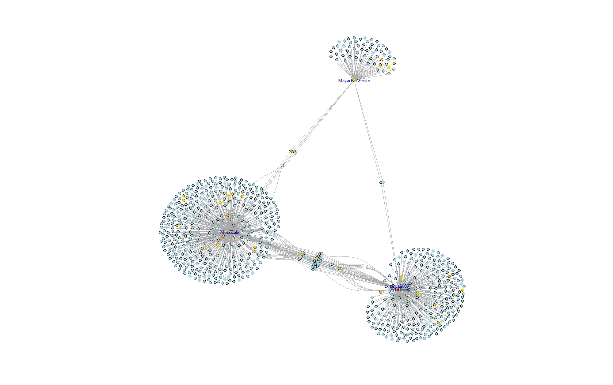    


> 網絡圖明顯可以看到有三個意見領袖，分別為MayorKoWenJe、Whitening、MoriiKaho，而且看到MayorKoWenJe、Whitening的意見領袖就是完全圍繞著這三個人，其中兩群的觀眾有些相似。兩個意見領袖中間的連結很多，這裡可以推測這兩個人對於朱立倫的PO文的觀眾很相似。  

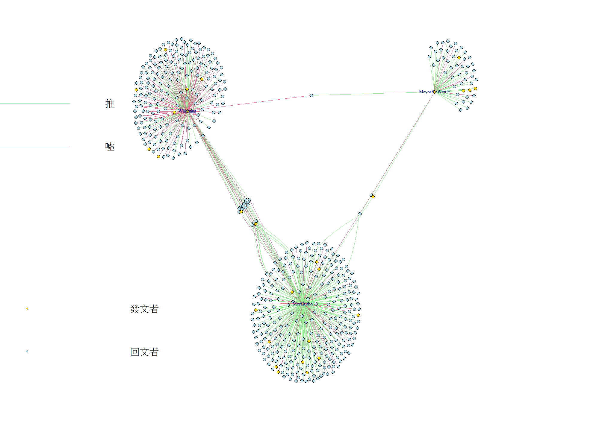  

>  加上推噓文可以發現群組內的特色就比較明顯：Whitening的噓數較多，MoriiKaho>的推數比較多，我們待會可以仔細看看他們的PO文內容。

## 頻率
```{r}
# 一號(這五個月發了27次文)
zhu_leader1 = zhu %>% filter(artPoster=="MayorKoWenJe")
summary(zhu_leader1)
zhu_leader1$artDate = as.Date(zhu_leader1$artDate)
zhu_leader1= zhu_leader1 %>% mutate(months = as.Date(cut(artDate, "months")))
zhu_leader1time = zhu_leader1 %>%group_by(months) %>%
  summarise(num=n()) %>% as.data.frame %>%  
  mutate( poster ="MayorKoWenJe" ) 


# 二號(這五個月發了13次文)
zhu_leader2 = zhu %>% filter(artPoster=="Whitening")
summary(zhu_leader2)
zhu_leader2$artDate = as.Date(zhu_leader2$artDate)
zhu_leader2= zhu_leader2 %>% mutate(months = as.Date(cut(artDate, "months")))
zhu_leader2time = zhu_leader2 %>%group_by(months) %>%
  summarise(num=n()) %>% as.data.frame %>%  
  mutate( poster ="Whitening" ) 

#三號(這五個月發了37次文)
zhu_leader3 = zhu %>% filter(artPoster=="MoriiKaho")
summary(zhu_leader3)
zhu_leader3$artDate = as.Date(zhu_leader3$artDate)
zhu_leader3= zhu_leader3 %>% mutate(months = as.Date(cut(artDate, "months")))
zhu_leader3time = zhu_leader3 %>%group_by(months) %>%
  summarise(num=n()) %>% as.data.frame %>%  
  mutate( poster ="MoriiKaho" ) 

# 整合他們的發文趨勢圖
zhu_leader = rbind(zhu_leader1time,zhu_leader2time,zhu_leader3time)
zhu_leader %>% ggplot(aes(x= months,y=num,fill=poster))  +geom_bar(stat = "identity")+
  facet_wrap(~poster, ncol = 2, scales = "free") 

```
  
  
> 先看MayorKoWenJe的貼文，主要集中在四五月，再來是MoriiKaho，貼文趨勢越來越多但到了四月卻變得很少，五月完全沒貼文，Whitening的貼文主要只集中在一、二月。整體貼文在五月很少，推測可能是五月的時候韓國瑜宣布要參加黨內初選，所以焦點都集中在韓國瑜身上，比較少人在關注朱立倫以及貼有關他的文章。

## 內容文字雲
```{r}
# 一號
# 先做斷句（以全形或半形驚歎號、問號、分號以及句號爲依據進行斷句）
devotion_sentences <- strsplit(zhu_leader1$sentence,"[。！；？!?;]")

# 將每句句子，與所屬的文章連結配對起來，整理成一個dataframe
devotion_sentences <- data.frame(
  id = rep(zhu_leader1$artUrl,sapply(devotion_sentences, length)), 
  sentence = unlist(devotion_sentences)) %>%
  filter(!str_detect(sentence, regex("^(\t|\n| )*$")))
devotion_sentences$sentence <- as.character(devotion_sentences$sentence)

# 使用斷詞引擎，放入要用的詞典和停用字
jieba_tokenizer = worker(user="dict/use_dict_2.txt", stop_word = "dict/stop_word_2.txt",write = "NOFILE")
chi_tokenizer <- function(t) {
  lapply(t, function(x) {
    if(nchar(x)>1){
      tokens <- segment(x, jieba_tokenizer)
      tokens <- tokens[nchar(tokens)>1]
      return(tokens)
    }
  })
}


# 進行斷詞，並計算各詞彙在各文章中出現的次數
devotion_words <- devotion_sentences %>%
  unnest_tokens(word, sentence, token=chi_tokenizer) %>%
  filter(!str_detect(word, regex("[0-9a-zA-Z]"))) %>%
  count(id, word, sort = TRUE)
# devotion_words %>%
#   group_by(word) %>%
#   summarise(sum = n())%>%
#   filter(sum>3)  %>%
#   arrange(desc(sum))  %>% wordcloud2(minSize = 3)
# 二號
# 先做斷句（以全形或半形驚歎號、問號、分號以及句號爲依據進行斷句）
devotion_sentences <- strsplit(zhu_leader2$sentence,"[。！；？!?;]")

# 將每句句子，與所屬的文章連結配對起來，整理成一個dataframe
devotion_sentences <- data.frame(
  id = rep(zhu_leader2$artUrl,sapply(devotion_sentences, length)), 
  sentence = unlist(devotion_sentences)) %>%
  filter(!str_detect(sentence, regex("^(\t|\n| )*$")))
devotion_sentences$sentence <- as.character(devotion_sentences$sentence)

# 使用斷詞引擎，放入要用的詞典和停用字
jieba_tokenizer = worker(user="dict/use_dict_2.txt", stop_word = "dict/stop_word_2.txt",write = "NOFILE")
chi_tokenizer <- function(t) {
  lapply(t, function(x) {
    if(nchar(x)>1){
      tokens <- segment(x, jieba_tokenizer)
      tokens <- tokens[nchar(tokens)>1]
      return(tokens)
    }
  })
}


# 進行斷詞，並計算各詞彙在各文章中出現的次數
devotion_words <- devotion_sentences %>%
  unnest_tokens(word, sentence, token=chi_tokenizer) %>%
  filter(!str_detect(word, regex("[0-9a-zA-Z]"))) %>%
  count(id, word, sort = TRUE)
# devotion_words %>%
#   group_by(word) %>%
#   summarise(sum = n())%>%
#   filter(sum>3)  %>%
#   arrange(desc(sum))  %>% wordcloud2(minSize = 3)

# 三號
# 先做斷句（以全形或半形驚歎號、問號、分號以及句號爲依據進行斷句）
devotion_sentences <- strsplit(zhu_leader3$sentence,"[。！；？!?;]")

# 將每句句子，與所屬的文章連結配對起來，整理成一個dataframe
devotion_sentences <- data.frame(
  id = rep(zhu_leader3$artUrl,sapply(devotion_sentences, length)), 
  sentence = unlist(devotion_sentences)) %>%
  filter(!str_detect(sentence, regex("^(\t|\n| )*$")))
devotion_sentences$sentence <- as.character(devotion_sentences$sentence)

# 使用斷詞引擎，放入要用的詞典和停用字
jieba_tokenizer = worker(user="dict/use_dict_2.txt", stop_word = "dict/stop_word_2.txt",write = "NOFILE")
chi_tokenizer <- function(t) {
  lapply(t, function(x) {
    if(nchar(x)>1){
      tokens <- segment(x, jieba_tokenizer)
      tokens <- tokens[nchar(tokens)>1]
      return(tokens)
    }
  })
}


# 進行斷詞，並計算各詞彙在各文章中出現的次數
devotion_words <- devotion_sentences %>%
  unnest_tokens(word, sentence, token=chi_tokenizer) %>%
  filter(!str_detect(word, regex("[0-9a-zA-Z]"))) %>%
  count(id, word, sort = TRUE)
# devotion_words %>%
#   group_by(word) %>%
#   summarise(sum = n())%>%
#   filter(sum>3)  %>%
#   arrange(desc(sum))  %>% wordcloud2(minSize = 3)
```
    

>  MayorKoWenJe的貼文主要都是轉貼朱立倫臉書的文章，所以有與政策相關的字詞出現，ex：產業、經濟、執政等等。平均推數：25、平均噓數：15，推數與噓數沒有相差很大，觀眾對於朱立倫臉書的文章推文筆較多。


  

>  Whitening的貼文主要是關注朱立倫的兩岸政策，在一、二月的時候兩岸政策很受人注目，所以這個帳號PO了很多與兩岸政策有關的文章，也出現了相關字詞：一中、大陸、九二等等。平均推數：28、平均噓數：35。國民黨的候選人講到兩岸政策都不能夠太明顯的表態，雖然朱立倫沒有很明顯的傾中，但是還是噓數會比較多。


  

>  MoriiKaho這個帳號幾乎都是轉貼朱立倫的新聞，並沒有帶個人色彩，只是單純轉貼新聞。平均推數30、平均噓數：11。單純轉貼新聞所獲得的推數比噓數還多，可看出朱立倫在PTT上的聲量較為正面。

## 情緒
```{r warning=FALSE}
# 載入stop words字典
stop_words <- read_file("dict/stop_word_2.txt")
stop_words <- strsplit(stop_words, "[\r]")[[1]]
stop_words <- data.frame(word = stop_words)
colnames(stop_words) = c("word")
stop_words <- read_file("dict/stop_word_2.txt")
stop_words <- strsplit(stop_words, "[\r]")[[1]]

# 載入negation words字典

negation_words = c("不是","不","未","未必","毫不","決不","沒有","沒","還沒有","還沒","還不","從來沒有","從來沒","從來不","從不","非","不會","不要","不行","無法")

# 把stop words中的negation words移掉
stop_words <- stop_words[!(stop_words %in% negation_words)]

# 載入斷詞字典
use_dict <- read_file("dict/use_dict_2.txt")
use_dict <- strsplit(use_dict, "[\r]")[[1]]
use_dict<- data.frame(word = use_dict)
colnames(use_dict) = c("nega_word")
use_dict <- read_file("dict/use_dict_2.txt")
use_dict <- strsplit(use_dict, "[\r]")[[1]]

# 載入liwc情緒字典
p <- read_file("dict/liwc/positive.txt")
n <- read_file("dict/liwc/negative.txt")
positive <- strsplit(p, "[,]")[[1]]
negative <- strsplit(n, "[,]")[[1]]
positive <- data.frame(word = positive, sentiments = "positive")
negative <- data.frame(word = negative, sentiemtns = "negative")
colnames(negative) = c("word","sentiment")
colnames(positive) = c("word","sentiment")
LIWC_ch <- rbind(positive, negative)
p <- read_file("dict/liwc/positive.txt")
n <- read_file("dict/liwc/negative.txt")
positive <- strsplit(p, "[,]")[[1]]
negative <- strsplit(n, "[,]")[[1]]

# 這裏不加入stop word字典(清掉的話會影響bigram結果)
jieba_tokenizer = worker()

# 使用還願字典重新斷詞，把否定詞也加入斷詞
new_user_word(jieba_tokenizer, c(use_dict,negation_words))

# unnest_tokens 使用的bigram分詞函數，並執行bigram分詞
jieba_bigram <- function(t) {
  lapply(t, function(x) {
    if(nchar(x)>1){
      tokens <- segment(x, jieba_tokenizer)
      bigram<- ngrams(unlist(tokens), 2)
      bigram <- lapply(bigram, paste, collapse = " ")
      unlist(bigram)
    }
  })
}

zhu_3 = zhu %>% filter(artPoster=="MayorKoWenJe"|artPoster=="Whitening"|artPoster=="MoriiKaho")
devotion_bigram <- zhu_3 %>%
  unnest_tokens(bigram,sentence, token = jieba_bigram)

# # 將bigram拆成word1和word2，並將包含英文字母或和數字的詞彙清除
# bigrams_separated <- devotion_bigram %>%
#   filter(!str_detect(bigram, regex("[0-9a-zA-Z]"))) %>%
#   separate(bigram, c("word1", "word2"), sep = " ")
# 
# # 並選出word2爲情緒詞的bigram
# devotion_sentiment_bigrams <- bigrams_separated %>%
#   filter(!word1 %in% stop_words) %>%
#   filter(!word2 %in% stop_words) %>%
#   inner_join(LIWC_ch, by = c(word2 = "word"))
# 
# # 選出word2中，有出現在情緒詞典中的詞彙
# # 如果是正面詞彙則賦予： 情緒標籤爲"positive"、情緒值爲  1
# # 如果是負面詞彙則賦予： 情緒標籤爲"negative"、情緒值爲 -1
# devotion_sentiment_bigrams1 <- devotion_sentiment_bigrams %>%
#   select(artUrl,artDate,artPoster, word1, word2) %>%
#   mutate(sentiment=ifelse(word2 %in% positive,1,-1), sentiment_tag=ifelse(word2 %in% positive, "positive", "negative"))
# 
# # 生成一個時間段中的 日期和情緒標籤的所有可能組合
# all_dates <-
#   expand.grid(seq(as.Date(min(devotion_sentiment_bigrams1$artDate)), as.Date(max(devotion_sentiment_bigrams1$artDate)), by="day"), c("positive", "negative"))
# names(all_dates) <- c("artDate", "sentiment")
# 
# # 反轉前面是否定詞且後面爲情緒詞彙的組合
# 
# devotion_sentiment_bigrams_negated <- devotion_sentiment_bigrams1 %>%
#   mutate(sentiment=ifelse(word1 %in% negation_words, (-1)*sentiment, sentiment)) %>%
#   mutate(sentiment_tag=ifelse(sentiment>0, "positive", "negative"))
# 
# # 計算我們資料集中每日的情緒值
# negated_sentiment_plot_data <- devotion_sentiment_bigrams_negated %>%
#   group_by(artUrl,artDate,artPoster,sentiment_tag,sentiment) %>%
#   summarise(count=n())
# 
# # 將所有 "日期與情緒值的所有可能組合" 與 "每日的情緒值" join起來
# # 如果資料集中某些日期沒有文章或情緒值，會出現NA
# # 我們用0取代NA
# negated_sentiment_plot_data <- all_dates %>%
#   merge(negated_sentiment_plot_data,by.x=c('artDate', "sentiment"),by.y=c("artDate", "sentiment_tag"),
#         all.x=T,all.y=T) %>%
#   mutate(count = replace_na(count, 0))
# 
# # 最後把圖畫出來
# negated_sentiment_plot_data=negated_sentiment_plot_data %>%
#   mutate(sentiment.y = replace_na(sentiment.y, 0)) %>%
#   mutate(count1 = sentiment.y * count)
# 
# negated_sentiment_plot_data1 =negated_sentiment_plot_data %>%filter(!is.na(artPoster))
# negated_sentiment_plot_data1 %>%
#   ggplot(aes(artDate,count1,fill=sentiment)) +
#   geom_col(show.legend = FALSE) +
#   facet_wrap(~ artPoster, scales = "fixed") +
#   scale_x_date(labels = date_format("%m-%d"))
```

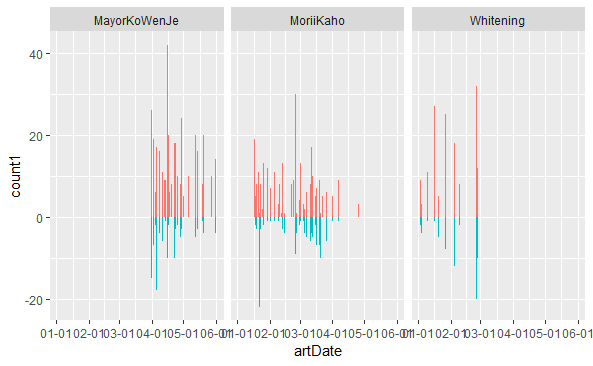  
  
> 三名意見領袖：MayorKoWenJe、MoriiKaho 、Whitening  

> *MayorKoWenJe*的貼文情緒都偏向正面，因為他主要都是轉貼FB的文章，通常政治人物的文章都會偏向於正面溫暖的文，所以貼文都偏向正面  
> **MoriiKaho**主要是轉貼朱立倫的新聞，所以也是正面情緒偏多
> **Whitening**的貼文，他都是有關兩岸政策的文章，但是原本預期會有較多負面詞，但是實際上分數並沒有偏向負面。  

> 朱立倫的三個意見領袖中，有一個會幫忙貼朱立倫的FB貼文，另一個貼有關兩岸論述的文章，最後一個是貼有關朱立倫的新聞，這三個中只有貼兩岸論述的文章噓數較推數多之外，其他兩個帳號的文章都是推文比較多，由此可知PTT上的網友對朱立倫沒有明顯的負面情緒。  


# 郭台銘的的ptt社群網絡領袖分析  

## 找出郭台銘的ptt意見領袖

### 整理並標記
```{r}
# 選出需要的欄位
kuo_r <- kuo_r[,c(4,7,8,10)]
colnames(kuo_r)=c("artUrl", "cmtPoster", "cmtStatus"," cmtContent")
# 發文者數量 1165
length(unique(kuo$artPoster))
# 回覆者數量 23464
length(unique(kuo_r$cmtPoster))
# 總共有參與的人數 23938
allPoster <- c(kuo$artPoster, kuo_r$cmtPoster)
length(unique(allPoster)) #去掉重複

# 整理所有出現過的使用者
# 如果曾發過文的話就標註他爲poster；沒有發過文的話則標註他爲replyer
userList <- data.frame(user=unique(allPoster)) %>%
              mutate(type=ifelse(user%in%kuo$artPoster, "poster", "replyer"))
```

### 建立社群網路圖
```{r}
# 把評論和文章依據artUrl innerJoin起來
kuo_all <- merge(x = kuo, y = kuo_r, by = "artUrl")

# 取出 cmtPoster(回覆者)、artPoster(發文者)、artUrl(文章連結) 三個欄位
link <- kuo_all %>%
      dplyr::select(cmtPoster, artPoster, artUrl)
# 這個順序是因為graph_from_data_frame 有規定(若有方向)第一個欄位是from 第二個欄位是to, 後面的欄位就是描述這個關係的東西

```
  
> 因網路評論人數較少，設定發文數大於5，回覆則數100以上，即納入圖片討論。

#### 縮小範圍  
篩掉1699個帳號，留下常活動的345個。

```{r}
# 篩選回應數和發文次數
# 郭台銘的文章相較柯p冷門,所以這邊回應數跟發文次數的調整不同於柯p
table(kuo$commentNum>=100)
kuo_poster=table(kuo$artPoster) %>% sort %>% as.data.frame 
colnames(kuo_poster)=c("artPoster","freq")
kuo_poster=kuo_poster %>% filter(freq>=5) 

link <- kuo_all %>%
  filter(commentNum >=100) %>% #回應數大於100則
  filter(artPoster==kuo_poster$artPoster) %>% #發文次數>=5次
  filter(cmtStatus!="→") %>%  # ptt篩出推噓
      select(cmtPoster, artPoster, artUrl, cmtStatus) 

# 這邊要篩選link中有出現的使用者(否則沒有在link中出現的使用者也會被igraph畫上去，沒有意義)
filtered_user <- userList %>%
          filter(user%in%link$cmtPoster | user%in%link$artPoster) %>% 
          arrange(desc(type))
```

#### 畫出關聯圖
```{r}
# # 建立網路關係
# set.seed(487)
# net <- graph_from_data_frame(d=link, v=filtered_user, directed=F)
# # DEGREE大於20 將印出LABEL否則則無
# labels <- degree(net)
# V(net)$label <- names(labels)
# 
# V(net)$color <- ifelse(V(net)$type=="poster", "gold", "lightblue")
# # 依據回覆發生的文章所對應的主題，對他們的關聯線進行上色
# E(net)$color <- ifelse(E(net)$cmtStatus == "推", "lightgreen", "palevioletred")
# 
# plot(net, vertex.size=2, edge.arrow.size=.2,
#      vertex.label=ifelse(degree(net) > 5, V(net)$label, NA),  vertex.label.ces=.5)
# # 加入標示
# legend(x=-1.5, y=-0.2, c("發文者","回文者"), pch=21,
#        col="#777777", pt.bg=c("gold","lightblue"), pt.cex=1, cex=2,
#        text.width=0.02,x.intersp=0.7,adj=1,y.intersp=0.1,bty="n")
# legend(x=-2, y=1, c("推","噓"),
#        col=c("lightgreen","palevioletred"), lty=1, cex=2,
#        text.width=0.02,x.intersp=0.7,adj=1,y.intersp=0.1,bty="n")
```
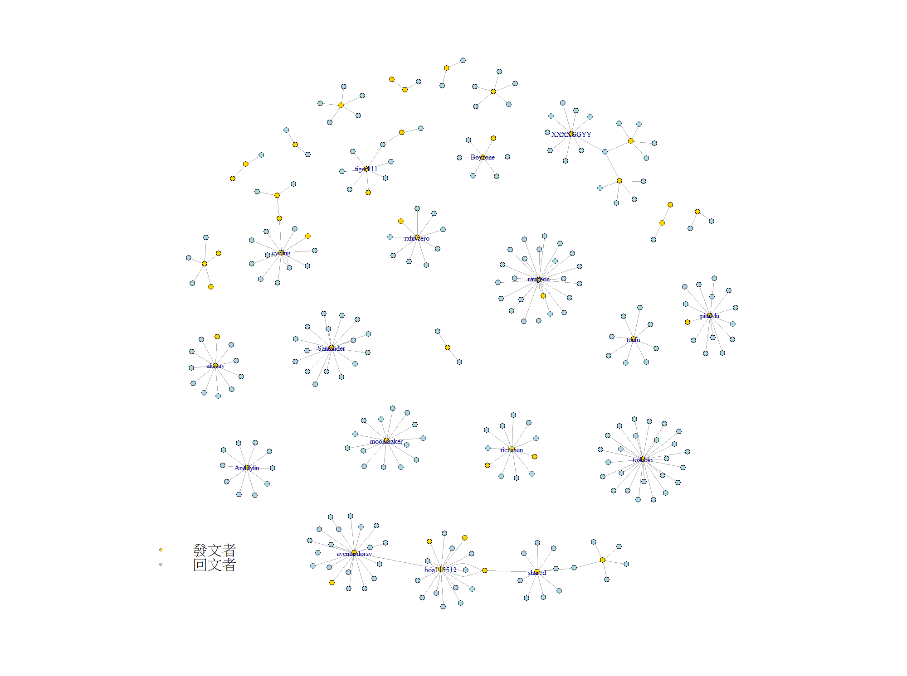  
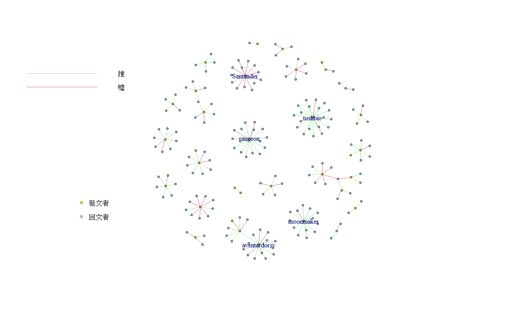 
  
> 我們抓出前三名意見領袖：raugeon、toshbio、aventardorsv，  
> 郭台銘的文章相較冷門，而且各發文與回文者的連結也沒有很深，幾乎都是很零散的文章，但群組內的特色就比較明顯，有一些就是幾乎都推文，有一些幾乎都噓文，但我們還是來看看其中比較明顯意見領袖的的特質與發文內涵。 


### 意見領袖的特質  

如發文內容、情緒、頻率

## 頻率
```{r}
# 一號(1個月內發了19次文)
kuo_leader1 = kuo %>% filter(artPoster=="raugeon")
summary(kuo_leader1)
kuo_leader1$artDate = as.Date(kuo_leader1$artDate)
kuo_leader1= kuo_leader1 %>% mutate(months = as.Date(cut(artDate, "months")))
kuo_leader1time = kuo_leader1 %>%group_by(months) %>%
  summarise(num=n()) %>% as.data.frame %>%  
  mutate( poster ="raugeon" ) 


# 二號(這2個月發了7次文)
kuo_leader2 = kuo %>% filter(artPoster=="toshbio")
summary(kuo_leader2)
kuo_leader2$artDate = as.Date(kuo_leader2$artDate)
kuo_leader2= kuo_leader2 %>% mutate(months = as.Date(cut(artDate, "months")))
kuo_leader2time = kuo_leader2 %>%group_by(months) %>%
  summarise( num=n()) %>%
  as.data.frame%>%  
  mutate( poster ="toshbio" ) 

#三號(這2個月發了6次文)
kuo_leader3 = kuo %>% filter(artPoster=="aventardorsv")
summary(kuo_leader3)
kuo_leader3$artDate = as.Date(kuo_leader3$artDate)
kuo_leader3= kuo_leader3 %>% mutate(months = as.Date(cut(artDate, "months")))
kuo_leader3time = kuo_leader3 %>%group_by(months) %>%
  summarise(num=n()) %>%
  as.data.frame%>%  
  mutate( poster ="aventardorsv" ) 

# 整合他們的發文趨勢圖
kuo_leader = rbind(kuo_leader1time,kuo_leader2time,kuo_leader3time)

kuo_leader %>% ggplot(aes(x= months,y=num,fill=poster))  +geom_bar(stat = "identity")+
  facet_wrap(~poster, ncol = 2, scales = "free") 
```
  
> 郭董四月才宣布參選，所以發文數沒有超過20篇的，且這3個帳號在1-3月都沒有關於郭董發文紀錄，另外raugeon集中在五月發了19篇，且討論度算高，感覺是比較狂熱的粉絲。　

## 內容文字雲
```{r}
# 一號
# 先做斷句（以全形或半形驚歎號、問號、分號以及句號爲依據進行斷句）
devotion_sentences <- strsplit(kuo_leader1$sentence,"[。！；？!?;]")

# 將每句句子，與所屬的文章連結配對起來，整理成一個dataframe
devotion_sentences <- data.frame(
  id = rep(kuo_leader1$artUrl,sapply(devotion_sentences, length)), 
  sentence = unlist(devotion_sentences)) %>%
  filter(!str_detect(sentence, regex("^(\t|\n| )*$")))
devotion_sentences$sentence <- as.character(devotion_sentences$sentence)

# 使用斷詞引擎，放入要用的詞典和停用字
jieba_tokenizer = worker(user="dict/use_dict_3.txt", stop_word = "dict/stop_word_3.txt",write = "NOFILE")
chi_tokenizer <- function(t) {
  lapply(t, function(x) {
    if(nchar(x)>1){
      tokens <- segment(x, jieba_tokenizer)
      tokens <- tokens[nchar(tokens)>1]
      return(tokens)
    }
  })
}


# 進行斷詞，並計算各詞彙在各文章中出現的次數
devotion_words <- devotion_sentences %>%
  unnest_tokens(word, sentence, token=chi_tokenizer) %>%
  filter(!str_detect(word, regex("[0-9a-zA-Z]"))) %>%
  count(id, word, sort = TRUE)
# devotion_words %>%
#   group_by(word) %>%
#   summarise(sum = n())%>%
#   filter(sum>3)  %>%
#   arrange(desc(sum)) %>% wordcloud2(minSize = 3)

# 二號
# 先做斷句（以全形或半形驚歎號、問號、分號以及句號爲依據進行斷句）
devotion_sentences <- strsplit(kuo_leader2$sentence,"[。！；？!?;]")

# 將每句句子，與所屬的文章連結配對起來，整理成一個dataframe
devotion_sentences <- data.frame(
  id = rep(kuo_leader2$artUrl,sapply(devotion_sentences, length)), 
  sentence = unlist(devotion_sentences)) %>%
  filter(!str_detect(sentence, regex("^(\t|\n| )*$")))
devotion_sentences$sentence <- as.character(devotion_sentences$sentence)

# 使用斷詞引擎，放入要用的詞典和停用字
jieba_tokenizer = worker(user="dict/use_dict_3.txt", stop_word = "dict/stop_word_3.txt",write = "NOFILE")
chi_tokenizer <- function(t) {
  lapply(t, function(x) {
    if(nchar(x)>1){
      tokens <- segment(x, jieba_tokenizer)
      tokens <- tokens[nchar(tokens)>1]
      return(tokens)
    }
  })
}


# 進行斷詞，並計算各詞彙在各文章中出現的次數
devotion_words <- devotion_sentences %>%
  unnest_tokens(word, sentence, token=chi_tokenizer) %>%
  filter(!str_detect(word, regex("[0-9a-zA-Z]"))) %>%
  count(id, word, sort = TRUE)
# devotion_words %>%
#   group_by(word) %>% 
#   summarise(sum = n())%>%
#   filter(sum>2)  %>% 
#   arrange(desc(sum)) %>% wordcloud2(minSize = 3)


# 三號
# 先做斷句（以全形或半形驚歎號、問號、分號以及句號爲依據進行斷句）
devotion_sentences <- strsplit(kuo_leader3$sentence,"[。！；？!?;]")

# 將每句句子，與所屬的文章連結配對起來，整理成一個dataframe
devotion_sentences <- data.frame(
  id = rep(kuo_leader3$artUrl,sapply(devotion_sentences, length)), 
  sentence = unlist(devotion_sentences)) %>%
  filter(!str_detect(sentence, regex("^(\t|\n| )*$")))
devotion_sentences$sentence <- as.character(devotion_sentences$sentence)

# 使用斷詞引擎，放入要用的詞典和停用字
jieba_tokenizer = worker(user="dict/use_dict_3.txt", stop_word = "dict/stop_word_3.txt",write = "NOFILE")
chi_tokenizer <- function(t) {
  lapply(t, function(x) {
    if(nchar(x)>1){
      tokens <- segment(x, jieba_tokenizer)
      tokens <- tokens[nchar(tokens)>1]
      return(tokens)
    }
  })
}


# 進行斷詞，並計算各詞彙在各文章中出現的次數
devotion_words <- devotion_sentences %>%
  unnest_tokens(word, sentence, token=chi_tokenizer) %>%
  filter(!str_detect(word, regex("[0-9a-zA-Z]"))) %>%
  count(id, word, sort = TRUE)
# devotion_words %>%
#   group_by(word) %>% 
#   summarise(sum = n())%>%
#   filter(sum>=2)  %>% 
#   arrange(desc(sum)) %>% wordcloud2(minSize = 3)
```

  
  

>　**raugeon**的發文數高，內文通常抒發己見為主，偶爾轉貼相關的新聞或分享郭比較出色的民調結果，且內容大多以抨擊韓國瑜的方式來支持郭台銘（用反諷的方式講韓政策，並使用經濟、希望等用詞來推郭董）
   

  

> **toshbio** 則是以分享臉書、媒體的方式來傳達有關郭董的事情，而且有在講民主、和平。  

  


> **aventardorsv** 則是偏向鄉民的內容（廢話不多說，有圖有真相之類的用語）　 

接著我們從發文者用詞情緒下手：

## 情緒
```{r warning=FALSE}
# 載入stop words字典
stop_words <- read_file("dict/stop_word_3.txt")
stop_words <- strsplit(stop_words, "[\r]")[[1]]
stop_words <- data.frame(word = stop_words)
colnames(stop_words) = c("word")
stop_words <- read_file("dict/stop_word_3.txt")
stop_words <- strsplit(stop_words, "[\r]")[[1]]

# 載入negation words字典

negation_words = c("不是","不","未","未必","毫不","決不","沒有","沒","還沒有","還沒","還不","從來沒有","從來沒","從來不","從不","非","不會","不要","不行","無法")

# 把stop words中的negation words移掉
stop_words <- stop_words[!(stop_words %in% negation_words)]

# 載入斷詞字典
use_dict <- read_file("dict/use_dict_3.txt")
use_dict <- strsplit(use_dict, "[\r]")[[1]]
use_dict<- data.frame(word = use_dict)
colnames(use_dict) = c("nega_word")
use_dict <- read_file("dict/use_dict_3.txt")
use_dict <- strsplit(use_dict, "[\r]")[[1]]

# 載入liwc情緒字典
p <- read_file("dict/liwc/positive.txt")
n <- read_file("dict/liwc/negative.txt")
positive <- strsplit(p, "[,]")[[1]]
negative <- strsplit(n, "[,]")[[1]]
positive <- data.frame(word = positive, sentiments = "positive")
negative <- data.frame(word = negative, sentiemtns = "negative")
colnames(negative) = c("word","sentiment")
colnames(positive) = c("word","sentiment")
LIWC_ch <- rbind(positive, negative)
p <- read_file("dict/liwc/positive.txt")
n <- read_file("dict/liwc/negative.txt")
positive <- strsplit(p, "[,]")[[1]]
negative <- strsplit(n, "[,]")[[1]]

# 這裏不加入stop word字典(清掉的話會影響bigram結果)
jieba_tokenizer = worker()

# 使用還願字典重新斷詞，把否定詞也加入斷詞
new_user_word(jieba_tokenizer, c(use_dict,negation_words))

# unnest_tokens 使用的bigram分詞函數，並執行bigram分詞
jieba_bigram <- function(t) {
  lapply(t, function(x) {
    if(nchar(x)>1){
      tokens <- segment(x, jieba_tokenizer)
      bigram<- ngrams(unlist(tokens), 2)
      bigram <- lapply(bigram, paste, collapse = " ")
      unlist(bigram)
    }
  })
}

kuo_3 = kuo %>% filter(artPoster=="raugeon"|artPoster=="toshbio"|artPoster=="aventardorsv")
devotion_bigram <- kuo_3 %>%
  unnest_tokens(bigram,sentence, token = jieba_bigram)

# # 將bigram拆成word1和word2，並將包含英文字母或和數字的詞彙清除
# bigrams_separated <- devotion_bigram %>%
#   filter(!str_detect(bigram, regex("[0-9a-zA-Z]"))) %>%
#   separate(bigram, c("word1", "word2"), sep = " ")
# 
# # 並選出word2爲情緒詞的bigram
# devotion_sentiment_bigrams <- bigrams_separated %>%
#   filter(!word1 %in% stop_words) %>%
#   filter(!word2 %in% stop_words) %>%
#   inner_join(LIWC_ch, by = c(word2 = "word"))   
# 
# # 選出word2中，有出現在情緒詞典中的詞彙
# # 如果是正面詞彙則賦予： 情緒標籤爲"positive"、情緒值爲  1
# # 如果是負面詞彙則賦予： 情緒標籤爲"negative"、情緒值爲 -1
# devotion_sentiment_bigrams1 <- devotion_sentiment_bigrams %>%
#   select(artUrl,artDate,artPoster, word1, word2) %>%
#   mutate(sentiment=ifelse(word2 %in% positive,1,-1), sentiment_tag=ifelse(word2 %in% positive, "positive", "negative"))
# 
# # 生成一個時間段中的 日期和情緒標籤的所有可能組合
# all_dates <- 
#   expand.grid(seq(as.Date(min(devotion_sentiment_bigrams1$artDate)), as.Date(max(devotion_sentiment_bigrams1$artDate)), by="day"), c("positive", "negative"))
# names(all_dates) <- c("artDate", "sentiment")
# 
# # 反轉前面是否定詞且後面爲情緒詞彙的組合
# 
# devotion_sentiment_bigrams_negated <- devotion_sentiment_bigrams1 %>%
#   mutate(sentiment=ifelse(word1 %in% negation_words, (-1)*sentiment, sentiment)) %>%
#   mutate(sentiment_tag=ifelse(sentiment>0, "positive", "negative"))
# 
# # 計算我們資料集中每日的情緒值
# negated_sentiment_plot_data <- devotion_sentiment_bigrams_negated %>%
#   group_by(artUrl,artDate,artPoster,sentiment_tag,sentiment) %>%
#   summarise(count=n())  
# 
# # 將所有 "日期與情緒值的所有可能組合" 與 "每日的情緒值" join起來
# # 如果資料集中某些日期沒有文章或情緒值，會出現NA
# # 我們用0取代NA
# negated_sentiment_plot_data <- all_dates %>% 
#   merge(negated_sentiment_plot_data,by.x=c('artDate', "sentiment"),by.y=c("artDate", "sentiment_tag"),
#         all.x=T,all.y=T) %>% 
#   mutate(count = replace_na(count, 0))
# 
# # 最後把圖畫出來
# negated_sentiment_plot_data=negated_sentiment_plot_data %>%
#   mutate(sentiment.y = replace_na(sentiment.y, 0)) %>%
#   mutate(count1 = sentiment.y * count)
# 
# negated_sentiment_plot_data1 =negated_sentiment_plot_data %>%filter(!is.na(artPoster))
# negated_sentiment_plot_data1 %>%
#   ggplot(aes(artDate,count1,fill=sentiment)) +
#   geom_col(show.legend = FALSE) +
#   facet_wrap(~ artPoster, scales = "fixed") +
#   scale_x_date(labels = date_format("%m-%d"))
```

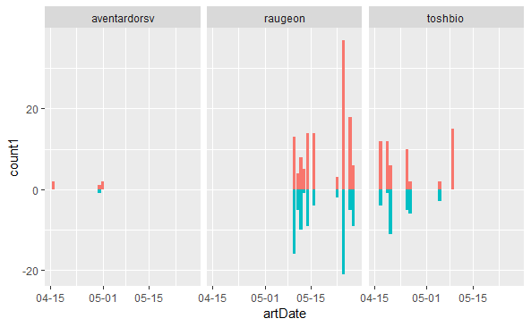
  
> 三名意見領袖： raugeon 、toshbio、 aventardorsv  

> **raugeon**因為是抨擊他人來挺郭，所以其正負面的情緒都蠻高的。    
> **toshbio**則是以分享報章媒體社團的方式,所以也有一些情緒用詞，因其多為正面，仔細一看，才發現此人大多分享其他政治人物回覆郭台銘言論的時事，所以沒有太多負面詞彙。    
> **aventardorsv**則是如上面文字雲所釋，多用圖來呈現，所以文字的情緒起伏也相對少。


# 柯文哲的ptt社群網絡領袖分析  

## 找出柯p的ptt意見領袖

### 整理並標記
```{r}
# 選出需要的欄位
kp_r <- kp_r[,c(4,7,8,10)]
colnames(kp_r)=c("artUrl", "cmtPoster", "cmtStatus"," cmtContent")
# 發文者數量 1879
length(unique(kp$artPoster))
# 回覆者數量 34561
length(unique(kp_r$cmtPoster))
# 總共有參與的人數 35022
allPoster <- c(kp$artPoster, kp_r$cmtPoster)
length(unique(allPoster)) #去掉重複

# 整理所有出現過的使用者
# 如果曾發過文的話就標註他爲poster；沒有發過文的話則標註他爲replyer
userList <- data.frame(user=unique(allPoster)) %>%
              mutate(type=ifelse(user%in%kp$artPoster, "poster", "replyer"))
```

### 建立社群網路圖
```{r}
# 把評論和文章依據artUrl innerJoin起來
kp_all <- merge(x = kp, y = kp_r, by = "artUrl")

# 取出 cmtPoster(回覆者)、artPoster(發文者)、artUrl(文章連結) 三個欄位
link <- kp_all %>%
      dplyr::select(cmtPoster, artPoster, artUrl)
# 這個順序是因為graph_from_data_frame 有規定(若有方向)第一個欄位是from 第二個欄位是to, 後面的欄位就是描述這個關係的東西

# 建立網路關係
net <- graph_from_data_frame(d=link, directed=T)

```

  
> 因網路評論人數高，設定發文數大於10，回覆則數500以上，才會納入圖片討論。

### 縮小範圍  
篩掉6846個帳號，留下常活動的300個。
```{r}
# 篩選回應數和發文次數
table(kp$commentNum>=500)
kp_poster=table(kp$artPoster) %>% sort %>% as.data.frame 
colnames(kp_poster)=c("artPoster","freq")
kp_poster=kp_poster %>% filter(freq>=10) 

link <- kp_all %>%
  filter(commentNum >=500) %>% #回應數大於500則
  filter(artPoster==kp_poster$artPoster) %>% #發文次數>10次
  filter(cmtStatus!="→") %>%  # ptt篩出推噓
      select(cmtPoster, artPoster, artUrl, cmtStatus) 

# 這邊要篩選link中有出現的使用者(否則沒有在link中出現的使用者也會被igraph畫上去，沒有意義)
filtered_user <- userList %>%
          filter(user%in%link$cmtPoster | user%in%link$artPoster) %>% 
          arrange(desc(type))
```

### 畫出關聯圖
```{r}
# # 建立網路關係
# set.seed(487)
# net <- graph_from_data_frame(d=link, v=filtered_user, directed=F)
# # DEGREE大於20 將印出LABEL否則則無
# labels <- degree(net)
# V(net)$label <- names(labels)
# 
# V(net)$color <- ifelse(V(net)$type=="poster", "gold", "lightblue")
# # 依據回覆發生的文章所對應的主題，對他們的關聯線進行上色
# E(net)$color <- ifelse(E(net)$cmtStatus == "推", "lightgreen", "palevioletred")
# 
# plot(net, vertex.size=2, edge.arrow.size=.2,
#      vertex.label=ifelse(degree(net) > 20, V(net)$label, NA),  vertex.label.ces=.5)
# # 加入標示
# legend(x=-1.5, y=-0.2, c("發文者","回文者"), pch=21,
#        col="#777777", pt.bg=c("gold","lightblue"), pt.cex=1, cex=2,
#        text.width=0.02,x.intersp=0.7,adj=1,y.intersp=0.1,bty="n")
# legend(x=-2, y=1, c("推","噓"), 
#        col=c("lightgreen","palevioletred"), lty=1, cex=2,
#        text.width=0.02,x.intersp=0.7,adj=1,y.intersp=0.1,bty="n")
```
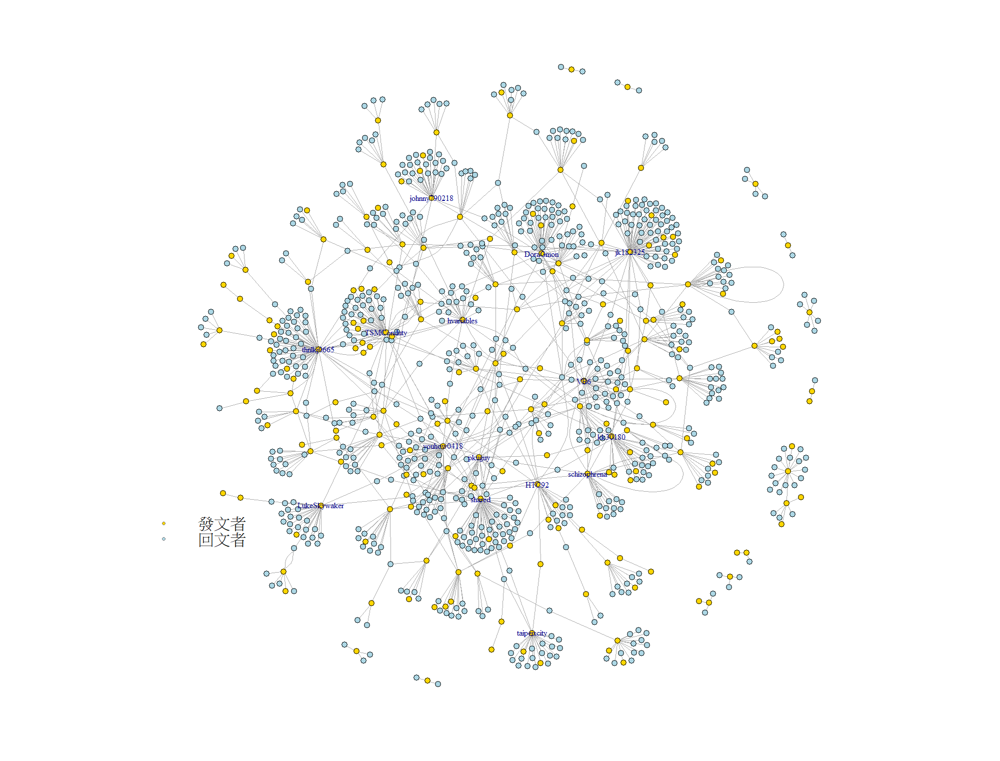    

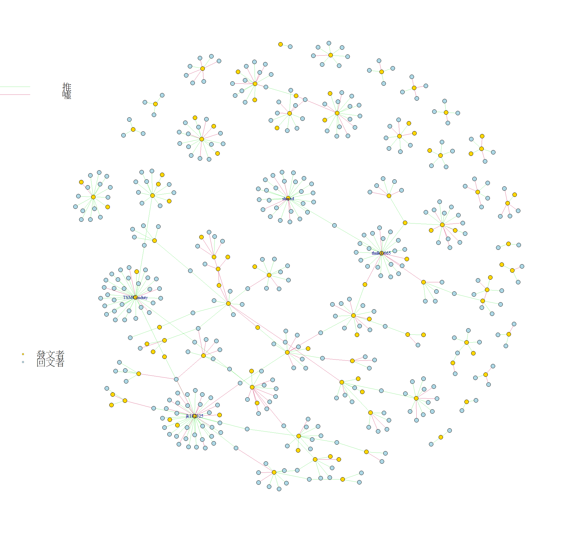  

> 我們抓出前三名意見領袖：jk182325、thnlkj0665、TSMConduty，  
> 柯文哲的ptt整體社群連結高，他的意見領袖在ptt上的發文和回文者的連結很深；但其實這些人並不一定是發最多次文的人，但他們卻是最能夠帶起風向且發文數仍有一定數量的人，且各自所屬的群體與群體之間仍有非常多的連結，接著我們就來看看他們的特質與發文內涵。另外，雖然這個網絡圖看出回文數高，但箭頭佔居多，代表他的回文幾乎都是中性，不然就是回文很長篇幅，所以下面的句子變成箭頭的那種。 


### 意見領袖的特質  

如發文內容、情緒、頻率

## 頻率
```{r}
# 一號(這五個月發了41次文)
kp_leader1 = kp %>% filter(artPoster=="jk182325")
summary(kp_leader1)
kp_leader1$artDate = as.Date(kp_leader1$artDate)
kp_leader1= kp_leader1 %>% mutate(months = as.Date(cut(artDate, "months")))
kp_leader1time = kp_leader1 %>%group_by(months) %>%
  summarise(num=n()) %>% as.data.frame %>%  
  mutate( poster ="jk182325" ) 


# 二號(這五個月發了54次文)
kp_leader2 = kp %>% filter(artPoster=="thnlkj0665")
summary(kp_leader2)
kp_leader2$artDate = as.Date(kp_leader2$artDate)
kp_leader2= kp_leader2 %>% mutate(months = as.Date(cut(artDate, "months")))
kp_leader2time = kp_leader2 %>%group_by(months) %>%
  summarise( num=n()) %>%
  as.data.frame%>%  
  mutate( poster ="thnlkj0665" ) 

#三號(這五個月發了78次文)
kp_leader3 = kp %>% filter(artPoster=="TSMConduty")
summary(kp_leader3)
kp_leader3$artDate = as.Date(kp_leader3$artDate)
kp_leader3= kp_leader3 %>% mutate(months = as.Date(cut(artDate, "months")))
kp_leader3time = kp_leader3 %>%group_by(months) %>%
  summarise(num=n()) %>%
  as.data.frame%>%  
  mutate( poster ="TSMConduty" ) 

# 整合他們的發文趨勢圖
kp_leader = rbind(kp_leader1time,kp_leader2time,kp_leader3time)
kp_leader %>% ggplot(aes(x= months,y=num,fill=poster))  +geom_bar(stat = "identity")+
  facet_wrap(~poster, ncol = 2, scales = "free") 

```
  
>  五月發文量都蠻高的，預估可能是柯文哲發表了自己在等待時機的言論，所以這些意見領袖就必須傳遞這些消息。


## 內容文字雲
```{r}
# 一號
# 先做斷句（以全形或半形驚歎號、問號、分號以及句號爲依據進行斷句）
devotion_sentences <- strsplit(kp_leader1$sentence,"[。！；？!?;]")

# 將每句句子，與所屬的文章連結配對起來，整理成一個dataframe
devotion_sentences <- data.frame(
  id = rep(kp_leader1$artUrl,sapply(devotion_sentences, length)), 
  sentence = unlist(devotion_sentences)) %>%
  filter(!str_detect(sentence, regex("^(\t|\n| )*$")))
devotion_sentences$sentence <- as.character(devotion_sentences$sentence)

# 使用斷詞引擎，放入要用的詞典和停用字
jieba_tokenizer = worker(user="dict/use_dict_3.txt", stop_word = "dict/stop_word_3.txt",write = "NOFILE")
chi_tokenizer <- function(t) {
  lapply(t, function(x) {
    if(nchar(x)>1){
      tokens <- segment(x, jieba_tokenizer)
      tokens <- tokens[nchar(tokens)>1]
      return(tokens)
    }
  })
}


# 進行斷詞，並計算各詞彙在各文章中出現的次數
devotion_words <- devotion_sentences %>%
  unnest_tokens(word, sentence, token=chi_tokenizer) %>%
  filter(!str_detect(word, regex("[0-9a-zA-Z]"))) %>%
  count(id, word, sort = TRUE)
# devotion_words %>%
#   group_by(word) %>% 
#   summarise(sum = n())%>%
#   filter(sum>3)  %>% 
#   arrange(desc(sum)) %>% wordcloud2(minSize = 3)

# 二號
# 先做斷句（以全形或半形驚歎號、問號、分號以及句號爲依據進行斷句）
devotion_sentences <- strsplit(kp_leader2$sentence,"[。！；？!?;]")

# 將每句句子，與所屬的文章連結配對起來，整理成一個dataframe
devotion_sentences <- data.frame(
  id = rep(kp_leader2$artUrl,sapply(devotion_sentences, length)), 
  sentence = unlist(devotion_sentences)) %>%
  filter(!str_detect(sentence, regex("^(\t|\n| )*$")))
devotion_sentences$sentence <- as.character(devotion_sentences$sentence)

# 使用斷詞引擎，放入要用的詞典和停用字
jieba_tokenizer = worker(user="dict/use_dict_3.txt", stop_word = "dict/stop_word_3.txt",write = "NOFILE")
chi_tokenizer <- function(t) {
  lapply(t, function(x) {
    if(nchar(x)>1){
      tokens <- segment(x, jieba_tokenizer)
      tokens <- tokens[nchar(tokens)>1]
      return(tokens)
    }
  })
}


# 進行斷詞，並計算各詞彙在各文章中出現的次數
devotion_words <- devotion_sentences %>%
  unnest_tokens(word, sentence, token=chi_tokenizer) %>%
  filter(!str_detect(word, regex("[0-9a-zA-Z]"))) %>%
  count(id, word, sort = TRUE)
# devotion_words %>%
#   group_by(word) %>% 
#   summarise(sum = n())%>%
#   filter(sum>3)  %>% 
#   arrange(desc(sum)) %>% wordcloud2(minSize = 3)


# 三號
# 先做斷句（以全形或半形驚歎號、問號、分號以及句號爲依據進行斷句）
devotion_sentences <- strsplit(kp_leader3$sentence,"[。！；？!?;]")

# 將每句句子，與所屬的文章連結配對起來，整理成一個dataframe
devotion_sentences <- data.frame(
  id = rep(kp_leader3$artUrl,sapply(devotion_sentences, length)), 
  sentence = unlist(devotion_sentences)) %>%
  filter(!str_detect(sentence, regex("^(\t|\n| )*$")))
devotion_sentences$sentence <- as.character(devotion_sentences$sentence)

# 使用斷詞引擎，放入要用的詞典和停用字
jieba_tokenizer = worker(user="dict/use_dict_3.txt", stop_word = "dict/stop_word_3.txt",write = "NOFILE")
chi_tokenizer <- function(t) {
  lapply(t, function(x) {
    if(nchar(x)>1){
      tokens <- segment(x, jieba_tokenizer)
      tokens <- tokens[nchar(tokens)>1]
      return(tokens)
    }
  })
}


# 進行斷詞，並計算各詞彙在各文章中出現的次數
devotion_words <- devotion_sentences %>%
  unnest_tokens(word, sentence, token=chi_tokenizer) %>%
  filter(!str_detect(word, regex("[0-9a-zA-Z]"))) %>%
  count(id, word, sort = TRUE)
# devotion_words %>%
#   group_by(word) %>% 
#   summarise(sum = n())%>%
#   filter(sum>3)  %>% 
#   arrange(desc(sum)) %>% wordcloud2(minSize = 3)
```

   

>　**jk182325**的文章大多是分享新聞居多(新聞記者等字)，內文大多跟柯文哲回覆別人的話或議題有關。  


    

>  **thnlkj0665**則是全部都在分享柯文哲臉書專頁的文章，並沒有什麼激烈用字或議題，只是純粹分享而已。  

 　  


> **TSMConduty**則是柯文哲臉書為主，或者是轉貼相關的新聞；其分享內容多元、有政策、平時發言評論、市政等；但因都是爭議性話題，所以底下推噓都算激烈，而其中有幾篇文章不是分享文章，而是以反諷的方式發表對柯文哲的不滿。

這邊就可以發現三位意見領袖，他們發文的方向就截然不同，那我們在更深入的看其情緒。

## 情緒
```{r warning=FALSE}
# 載入stop words字典
stop_words <- read_file("dict/stop_word_3.txt")
stop_words <- strsplit(stop_words, "[\r]")[[1]]
stop_words <- data.frame(word = stop_words)
colnames(stop_words) = c("word")
stop_words <- read_file("dict/stop_word_3.txt")
stop_words <- strsplit(stop_words, "[\r]")[[1]]

# 載入negation words字典

negation_words = c("不是","不","未","未必","毫不","決不","沒有","沒","還沒有","還沒","還不","從來沒有","從來沒","從來不","從不","非","不會","不要","不行","無法")

# 把stop words中的negation words移掉
stop_words <- stop_words[!(stop_words %in% negation_words)]

# 載入斷詞字典
use_dict <- read_file("dict/use_dict_3.txt")
use_dict <- strsplit(use_dict, "[\r]")[[1]]
use_dict<- data.frame(word = use_dict)
colnames(use_dict) = c("nega_word")
use_dict <- read_file("dict/use_dict_3.txt")
use_dict <- strsplit(use_dict, "[\r]")[[1]]

# 載入liwc情緒字典
p <- read_file("dict/liwc/positive.txt")
n <- read_file("dict/liwc/negative.txt")
positive <- strsplit(p, "[,]")[[1]]
negative <- strsplit(n, "[,]")[[1]]
positive <- data.frame(word = positive, sentiments = "positive")
negative <- data.frame(word = negative, sentiemtns = "negative")
colnames(negative) = c("word","sentiment")
colnames(positive) = c("word","sentiment")
LIWC_ch <- rbind(positive, negative)
p <- read_file("dict/liwc/positive.txt")
n <- read_file("dict/liwc/negative.txt")
positive <- strsplit(p, "[,]")[[1]]
negative <- strsplit(n, "[,]")[[1]]


# 這裏不加入stop word字典(清掉的話會影響bigram結果)
jieba_tokenizer = worker()

# 使用還願字典重新斷詞，把否定詞也加入斷詞
new_user_word(jieba_tokenizer, c(use_dict,negation_words))

# unnest_tokens 使用的bigram分詞函數，並執行bigram分詞
jieba_bigram <- function(t) {
  lapply(t, function(x) {
    if(nchar(x)>1){
      tokens <- segment(x, jieba_tokenizer)
      bigram<- ngrams(unlist(tokens), 2)
      bigram <- lapply(bigram, paste, collapse = " ")
      unlist(bigram)
    }
  })
}
kp_3 = kp %>% filter(artPoster=="jk182325"|artPoster=="thnlkj0665"|artPoster=="TSMConduty")
devotion_bigram <- kp_3 %>%
  unnest_tokens(bigram,sentence, token = jieba_bigram)

# # 將bigram拆成word1和word2，並將包含英文字母或和數字的詞彙清除
# bigrams_separated <- devotion_bigram %>%
#   filter(!str_detect(bigram, regex("[0-9a-zA-Z]"))) %>%
#   separate(bigram, c("word1", "word2"), sep = " ")
# 
# # 並選出word2爲情緒詞的bigram
# devotion_sentiment_bigrams <- bigrams_separated %>%
#   filter(!word1 %in% stop_words) %>%
#   filter(!word2 %in% stop_words) %>%
#   inner_join(LIWC_ch, by = c(word2 = "word"))   
# 
# # 選出word2中，有出現在情緒詞典中的詞彙
# # 如果是正面詞彙則賦予： 情緒標籤爲"positive"、情緒值爲  1
# # 如果是負面詞彙則賦予： 情緒標籤爲"negative"、情緒值爲 -1
# devotion_sentiment_bigrams1 <- devotion_sentiment_bigrams %>%
#   select(artUrl,artDate,artPoster, word1, word2) %>%
#   mutate(sentiment=ifelse(word2 %in% positive,1,-1), sentiment_tag=ifelse(word2 %in% positive, "positive", "negative"))
# 
# # 生成一個時間段中的 日期和情緒標籤的所有可能組合
# all_dates <- 
#   expand.grid(seq(as.Date(min(devotion_sentiment_bigrams1$artDate)), as.Date(max(devotion_sentiment_bigrams1$artDate)), by="day"), c("positive", "negative"))
# names(all_dates) <- c("artDate", "sentiment")
# 
# # 反轉前面是否定詞且後面爲情緒詞彙的組合
# 
# devotion_sentiment_bigrams_negated <- devotion_sentiment_bigrams1 %>%
#   mutate(sentiment=ifelse(word1 %in% negation_words, (-1)*sentiment, sentiment)) %>%
#   mutate(sentiment_tag=ifelse(sentiment>0, "positive", "negative"))
# 
# # 計算我們資料集中每日的情緒值
# negated_sentiment_plot_data <- devotion_sentiment_bigrams_negated %>%
#   group_by(artUrl,artDate,artPoster,sentiment_tag,sentiment) %>%
#   summarise(count=n())  
# 
# # 將所有 "日期與情緒值的所有可能組合" 與 "每日的情緒值" join起來
# # 如果資料集中某些日期沒有文章或情緒值，會出現NA
# # 我們用0取代NA
# negated_sentiment_plot_data <- all_dates %>% 
#   merge(negated_sentiment_plot_data,by.x=c('artDate', "sentiment"),by.y=c("artDate", "sentiment_tag"),
#         all.x=T,all.y=T) %>% 
#   mutate(count = replace_na(count, 0))
# 
# # 最後把圖畫出來
# negated_sentiment_plot_data=negated_sentiment_plot_data %>%
#   mutate(sentiment.y = replace_na(sentiment.y, 0)) %>%
#   mutate(count1 = sentiment.y * count)
# 
# negated_sentiment_plot_data1 =negated_sentiment_plot_data %>%filter(!is.na(artPoster))
# negated_sentiment_plot_data1 %>%
#   ggplot(aes(artDate,count1,fill=sentiment)) +
#   geom_col(show.legend = FALSE) +
#   facet_wrap(~ artPoster, scales = "fixed") +
#   scale_x_date(labels = date_format("%m-%d"))
```

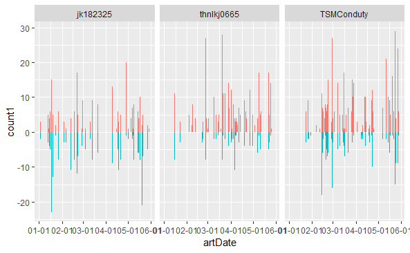    
  
> 三名意見領袖：jk182325、thnlkj0665、TSMConduty
> **jk182325** 雖然適用分享新聞的方式，但其分享的新聞情緒字眼都蠻多的，所以起伏非常大  
> **thnlkj0665** 的情緒又更加明顯，但以正面居多，推估是因為其大多分享柯文哲的臉書文章，也因此用詞都會較為正面（候選人粉專大多不會有過度負面的情緒字眼）。  
> **TSMConduty**發文數高情緒較密集，因分享柯文哲文章居多使其正面情緒較高，但又因是爭議性文章使其高低起伏不定。
  
> 有趣的是，回頭看社群關聯圖中，推噓文的顏色線條，我們發現起伏較大的情緒文章（jk182325的文）噓文相較於其他人多，除了直觀感受，也有可能是因為其情緒詞較多，導致討論度高，推文和噓文都會連帶比其他意見領袖多。　　


# 肆、word2vector相似詞比較  

## 生成模型

```{r}
# 以下為Python 語法
# import logging
# from gensim.models import word2vec
# 
# logging.basicConfig(format='%(asctime)s : %(levelname)s : %(message)s', level=logging.INFO)
# 
# sentences = word2vec.LineSentence("data/try_utf8.txt")
# model = word2vec.Word2Vec(sentences, size=300, workers=3, window=5, min_count=15, iter=5)
# 
# #保存模型，供日後使用
# model.save("data/3-CISWord2Vec-try.model")
# model.wv.save_word2vec_format("data/3-CISWord2Vec-try.model", binary = False)
```

+  訓練資料：
>  2019年1月1日至2019年5月31日，ptt社群候選人相關發文資料，隨機取4/5分析

## 找字詞相似性

```{r}
# 以下為Python 語法
# from gensim import models
# import logging
# 
# logging.basicConfig(format='%(asctime)s : %(levelname)s : %(message)s', level=logging.INFO)
# model = models.keyedvectors.KeyedVectors.load_word2vec_format("data/3-CISWord2Vec-try.model", binary = False)
# 
# #範例字串
# str1 = "朱立倫"
# str2 = "韓國瑜"
# str3 = "總統"
# 
# #要用的話要打開
# strLst = ["蔡英文","賴清德","朱立倫","韓國瑜","郭台銘","柯文哲"]
# 
# print("%s 相似詞前10 :" %str3)
# res = model.most_similar(str3 ,topn = 20)
# for item in res:
# 	print(item[0]+","+ str(item[1]))
# 
# print("")
# print("%s vs %s Cosine 相似度: " % (str1,str3))
# res = model.similarity(str1 , str3)
# print(res)
# 
# print("")
# print("%s 之於 %s，如 %s 之於 " % (str5,str3,str1))
# res = model.most_similar([str5,str1], [str3], topn= 10)
# for item in res:
# 	print(item[0]+","+ str(item[1]))
# 
# print("====================================")
# for i in range(len(strLst)):
#     print("%s 相似詞前10 :" % strLst[i])
#     res = model.most_similar(strLst[i] ,topn = 20)
#     for item in res:
# 	    print(item[0]+","+ str(item[1]))
#     print("====================================")
```

>  為驗證訓模型正確性，以「總統」為標的，尋找相似詞

+  「總統」相似詞：
>  領導人   ,0.421120285987854 
>  下任總統 ,0.3970821797847748 
>  民選總統 ,0.39381736516952515 
>  520      ,0.3750308156013489 
>  國家元首 ,0.36245524883270264 
>  蔡賴配   ,0.35755008459091187 
>  總統大選 ,0.3544211685657501 
>  脫黨     ,0.35220929980278015

+ 模型判定：
>有「領導人」、「下任總統」等近似詞， 其中出現「蔡賴配」與「脫黨」等字詞， >顯示網友常提及蔡賴檔，或集中討論賴、 蔡或韓國瑜脫黨參選的可能。


## 各個準參選人相似字詞比較

>在各參選人的相似字詞比較上，我們聚焦藍綠兩黨討論度相對高的兩組參選人，國民黨的韓國瑜與郭台銘、民進黨的賴清德與蔡英文等人上。各取文字向量模型中，相似性和代表性相對較高的前幾名進行比較。


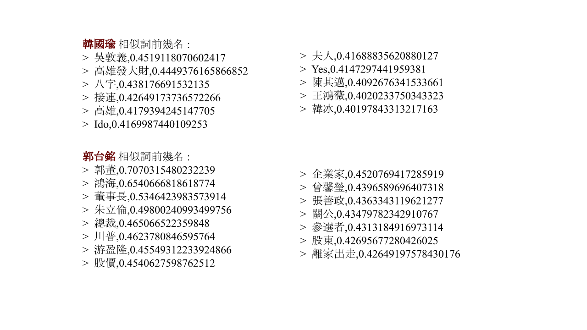


+ 郭台銘
> 「郭董」、「董事長」、「總裁」、 「企業家」、「參選者」，和其身為鴻 海董事長兼總統參選人的身分有關。 「離家出走」、「股價」、「關公」和 選舉動態相關。

+ 韓國瑜
>韓國瑜的相似詞和其宣傳的個人特質較 為相關，如「八字」以民俗傳統渲染， 同時也出現「高雄發大財」、「Ido」、 等政治宣言，同時「夫人」、「陳其邁」 也是積極討論的對象。

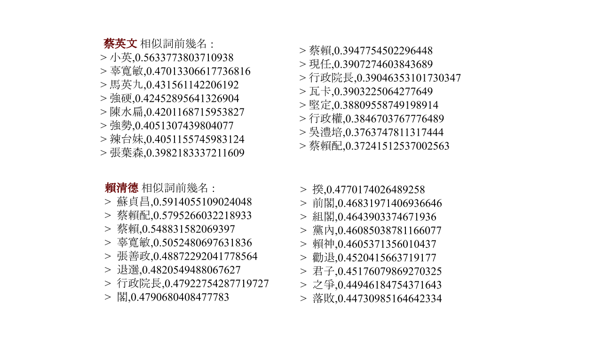


+ 賴清德
>「蘇貞昌」、「行政院長」、「前閣」，因曾任行政院院長；「賴神」，個人風格 相關；「君子之爭」、「勸退」、「辜寬敏」、「吳澧培」、「張善政」，黨內初 選活動相關

+ 蔡英文
>「馬英九」、「陳水扁」因當過總統， 故常與之一起比較，而「強勢」、「辣 台妹」、「堅定」而顯現其政治態度。 最後「瓦卡」、「辜寬敏」、「張葉森」 則近期評論總統大選的重要人士。

## 小結

> 其中經過比較後發現，相似字詞大約可以分為兩類：
> 第一類和候選人本身特質相關，可以其看出其在網民心中大略的政治形象。
> 如郭台銘就有「郭董」、「總裁」、「企業家」等，可看出選民對其與鴻海董事長的企業家形象印象較為深刻。
> 
> 第二類則為與候選人相關的話題事件，如韓國瑜的「八字」，顯示其在形象討論上，著重民俗專家的加持宣傳，「高雄發大財」、「Yes」、「Ido」就與其政治標語有關，也因其常與「陳其邁」的相提討論，可由其找出影響該位候選人形象形塑的政治事件與利害關係人。

## 各個準參選人與總統詞彙的相似度  

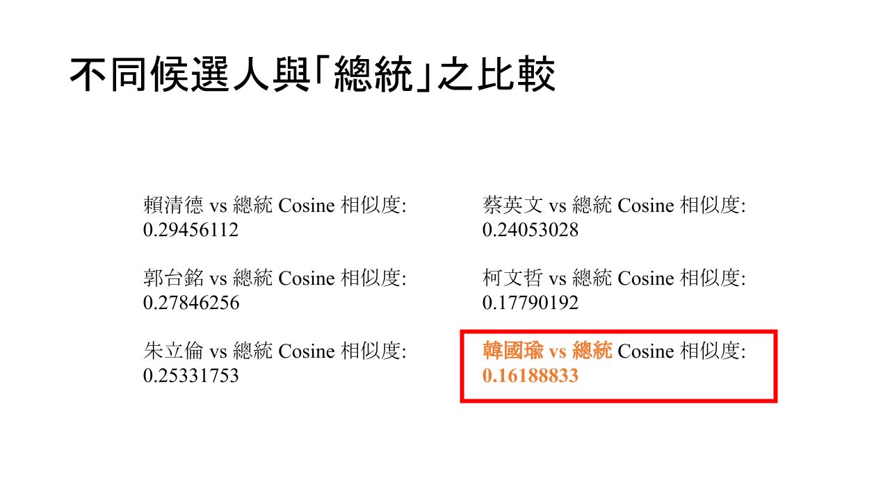    
> 賴清德 vs 總統 Cosine 相似度: 0.29456112    
> 郭台銘 vs 總統 Cosine 相似度: 0.27846256      
> 朱立倫 vs 總統 Cosine 相似度: 0.25331753            
> 蔡英文 vs 總統 Cosine 相似度: 0.24053028                 
> 柯文哲 vs 總統 Cosine 相似度: 0.17790192               
> 韓國瑜 vs 總統 Cosine 相似度: 0.16188833              

>其中與「總統」相似度越高，與網路風向中期望總統之作為、言行等表現較為符合。從中可以發現「蔡英文」作為總統，相似度卻並非最高，推估可能因近期政治行銷方向形塑的候選人形象較為活潑，和傳統的總統形象並不同所致。而韓國瑜的相似度最低，推估可能因其娛樂性高，非政治性話題討論度高所致，顯示其與傳統預期的總統形象十分不同。

## 各個參選人「之於」的比較  

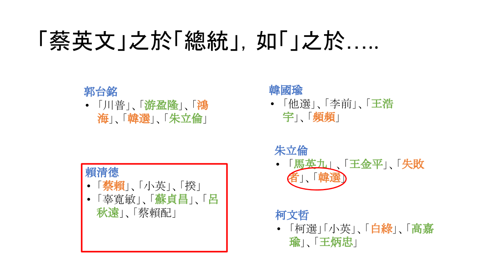    

+  郭台銘
> 川普,0.39386168122291565
> 游盈隆,0.39299559593200684
> 鴻海,0.37823694944381714
> 韓選,0.343005895614624
> 朱立倫,0.33445948362350464

+  韓國瑜
> 他選,0.30929064750671387
> 李前,0.2825775146484375
> 王浩宇,0.27755582332611084

+  朱立倫
> 馬英九,0.43506184220314026
> 王金平,0.35224074125289917
> 失敗者,0.335927814245224
> 韓選,0.3310021460056305

+  柯文哲
> 小英,0.3106113076210022
> 白綠,0.3047139048576355
> 高嘉瑜,0.29249924421310425
> 王炳忠,0.2882677912712097

+  賴清德
> 蔡賴,0.4917539060115814
> 小英,0.45785361528396606
> 揆,0.4020141363143921
> 辜寬敏,0.39523911476135254
> 蘇貞昌,0.384945809841156
> 呂秋遠,0.37828728556632996
> 蔡賴配,0.3678438067436218

> 挑選「蔡英文」之於「總統」，相當於其他候選人之於其他字詞，作為比較標的：
> 希望依此找出其他候選人在參選總統上，較為相關的「利害關係人」或與其他政治人物的「相對關係」，以此回推該位候選人在網民討論度中較為重要的選舉角色。

# 伍、總結  
1.  炒起聲量的方式  
+  賴清德：分享民調  
+  蔡英文：臉書傳聲筒  
+  柯文哲：爭議性話題  
+  韓國瑜：新聞與黑特的己見  
+  朱立倫：政策與兩岸議題  
+  郭台銘：抨擊參選人  

2.  他們帶起的風向的是正面還是負面形象？  
意見領袖不一定都是支持者，像是韓國瑜、柯文哲等人的意見領袖就是偏黑特他們的人。另外一提：網軍就是偏支持與護航者，所以如果要尋找網軍，可能要使用別種方式，如文章發表數高、回覆數少的對象！
  
3.  成功與否？  
來自於其文章是否能引起共鳴或者回應（不論推噓），由我們的篩法可以得知，其各自的方法應該都有成功引起話題。

4.  彼此之間有什麼差異？  
每家候選人的意見領袖各有不同的發文風格，大多是以分享新聞、臉書、民調、時事為主，會給人比較可信，並且比較願意去討論（如果只有純粹抒發己見，恐怕太個版，不會有人想一同討論）。  
  
5.  我們探討出來的相似詞彙？  
可看出塑造此候選人形象之重要事件與連帶關係人，網友對國民黨候選郭韓兩人形象集中在較具戲劇性、話題性事件，而對民進黨則是偏向較嚴肅的政治討論。  
  
6.  藉由文字轉向量，可看出塑造此候選人形象之重要事件與連帶關係人，網友對國民黨候選郭韓兩人形象集中在較具戲劇性、話題性事件，而對民進黨則是偏向較嚴肅的政治討論。  
  
7.  這次網路聲量上能夠占一席之地的參選人會是誰？  
在ptt上看起來似乎是……爭議越多，討論度越高！


# 參考文獻  

    Lazarsfeld, P. F., Berelson, B., & Gaudet, H. (1944). The people’s choice. How the voter makes up his mind in a presidential campaign. New York, NY: Columbia University Press.  

    Park, C. S. (2013). Does Twitter motivate involvement in politics? Tweeting, opinion leadership, and political engagement. Computers in Human Behavior, 29(4), 1641-1648. 
  
    吳學展(2015)。【解構 PTT】有自己的法律、法院和貨幣，沒被臉書淘汰的 PTT 是台灣民主化的重要推手。橘報。取自https://buzzorange.com/  

    劉揚銘，陳伯璿，胡舜詅，周昱璇(2016)。解讀Ptt：台灣最有影響力的網路社群。數位時代。取自https://www.bnext.com.tw/  
        
    賴珍琳(2008)。解構台灣最大網路社群批踢踢（PTT）。今周刊。取自https://www.businesstoday.com.tw/  
    
    陳明謙(2013)社群影響力分析於社群網路中。國立中央大學資訊工程學系論文。
    
    許原榮(2017)臺灣民眾社群媒體的政治性使用對政治參與的影響。國立臺北大學社會學系論文。

    